# 2022-2023 学年 秋冬学期 期末复习

本页面针对 2022-2023 学年 zkg 老师划定的范围进行复习，其他内容因时间关系不详细展开。以下目录基于《计算机网络》（第六版）[美] Andrew S. Tanenbaum 等 著。

由于网络安全部分没有其他参考资料，因此内容会更加详细，我放在了另一个单独的文档中。

## 第一章 引言（小于10分）

### 1.5 网络协议

**设计目标**

* Reliability 可靠性：从错误、失败中恢复的能力
* Resource allocation 资源配置：共享相同的有限资源
* Evolvability 可进化性（可扩展性）：支持协议升级
* Security 安全性：预防网络中的多种攻击

**协议层次结构**

* 为了降低网络设计的复杂性，绝大多数网络都组织成一个**层次栈（a stack of layer）**或**分级栈（a stack of level）**；
* 不同机器上构成相应层次的实体称为**对等体（peer）**；
* 层和协议的集合称为**网络体系结构（network architecture）**，一个特定的系统所使用的一组协议，即每一层一个协议，称为**协议栈（protocol stack）**。

**面向连接服务 vs. 无连接服务**

面向连接服务

* 服务用户首先必须建立一个连接，然后使用该连接传输数据，最后释放该连接，绝大多数情况下，数据位保持原来的顺序，所以数据位都会按照发送的顺序到达；
* 有些情况建立连接，发送方、接收方和子网一起协商（negotiation）一组参数，如最大消息长度、要求的服务质量等。一般一方提出一个建议，另一方接受或拒绝甚至提出相反建议；
* 电路（circuit）是与资源关联的连接的另一个名字，比如具有固定的带宽；
* 两个细微的变异形式：报文序列和字节流。在前一种变异中，报文的边界始终得到保持。发送两个 1024 字节的报文，收到的仍然是两个独立的长度为1024 字节的报文，不可能变成一个长度为 2048 字节的报文。在后一种变异中，该连接只是一个字节流，没有任何报文边界。

无连接服务

* 场景：确认而引入的传输延迟是不可接受的场景，如 IP 语音（voice over IP）采用数字语音传输，宁可时不时地听到线路上有一点噪音，也无法容忍因等待确认而带来的延迟；
* 每个报文（信件）都携带了完整的目标地址，每个报文都由系统中的中间节点路由且路由独立于后续报文。报文（message）在不同的上下文中有不同的称呼；数据包/包（packet）是网络层的报文。注意先发送的报文可能被延迟，因而后发送的报文比它先到达，这种情况也是有可能发生的；
* 如果中间节点只能在收到报文的**全部内容**之后再将该报文发送给下一个节点，那么我们就称这种处理方式为**存储-转发交换（store-and-forward switching）**。另一种处理方式是在报文还没有被全部接收完毕之前就向下一个节点传输，称为**直通式交换（cut-through switching）**；
* **不可靠（意味着没有被确认）**的无连接服务通常称为**数据报服务（datagram service）**；有时需要无需建立连接就可发送报文的便利性，但是可靠性仍然是基本需求。**有确认的数据报服务（acknowledged datagram service）**就是为这些应用提供的一类服务；还有另外一种服务是**请求-应答服务（request-reply service）**。在这种服务中，发送方传输一个包含了某个请求的数据报；接受方以一个包含了请求结果的应答数据报作为反馈。

数据交换的几种方式

* **电路交换 circuit switching**：数据传输前，两个节点之间必须先建立一条专用（双方独占）的物理通信路径，分为三个阶段：连接建立-数据传输-连接释放；
* **报文交换 message switching**：数据交换的单位是报文，在交换节点采用存储转发方式传输；
* **分组交换 package switching**：包括**虚电路 virtual circuit** 和**数据报 data gram**。同样采用存储转发模式，但限制每次传送的数据块大小上限，将大的数据块划分为合理的的小数据块，再加上必要控制信息构成分组（packet）。数据报不保证可靠性，分组不一定有序到达，虚电路将数据报和电路交换结合，在通信双方之间里逻辑线路，数据分组需要有分组号、校验号和虚电路号等，提供可靠通信功能，保证每个分组正确且有序到达。

**特定服务原语 Specific service primitives**

一个服务由一组原语（primitive）正式说明，用户进程通过这些原语（操作）来访问该服务。如果协议栈位于操作系统中（大多数情况是这样的），则这些服务原语通常是一些系统调用。可用的原语取决于底层所提供的服务。面向连接服务的原语与无连接服务的原语是不同的。

### 1.6 参考模型（OSI）*

OSI 模型中将我们上课讲解的传输层分为了三个层次，这里强调一下：

* 传输层（transport layer）：接收来自上一层的数据，在必要的时候把这些数据分割成较小的单元，然后把这些数据单元传递给网络层，并且确保这些数据单元正确地到达另一端。即负责两个进程间端到端的通信，**为端到端提供可靠的传输服务**，提供流量控制、差错控制、服务质量、数据传输管理等服务；
* 会话层（session layer）：允许不同主机上的各个进程之间会话，提供**会话控制（dialog control，记录该由谁来传递数据）、令牌管理（token management，禁止双方同时执行同一个关键操作），以及同步功能（synchronization，在一个长传输过程中设置一些断点，以便在系统崩溃后还能恢复到崩溃前的状态继续运行）**；
* 表示层（presentation layer）：**关注传递信息的语法和语义**。不同的计算机可能有不同的内部数据表示法，为了让这些计算机能够进行通信，它们所交换的数据结构必须以一种抽象的方式来定义，管理这些抽象的数据结构，并允许定义和交换更高层的数据结构（比如银行账户记录）。**数据压缩、加密和解密**也是表示层可提供的数据表示变换功能。

OSI 模型的核心是如下 3 个概念：

1. 服务：每一层都为它的上一层（垂直的）执行某些服务。服务定义说明了该层是**做什么**的，而**不是上一层实体如何访问这一层，或这一层是如何工作的（协议）**，它定义了这一层的语义；
2. 接口：每一层的接口告诉它**上面的进程如何访问本层**。它规定了有哪些参数，以及结果是什么。但它没有说明本层内部是如何工作；
3. 协议：由语法、语义和同步三部分构成，每一层用到的对等协议是本层（水平的）自己内部的事情。它可以使用任何协议，只要它能够完成任务就行（也就是说提供所承诺的服务）。它也可以随意地改变协议而不影响它上面的各层。

注意，服务定义了该层准备代表其用户执行哪些操作，但是它并不涉及如何实现这些操作。服务与两层之间的接口有关，低层是服务提供者，而上层是服务用户。而协议是一组规则，规定了同一层上对等实体之间所交换的数据包或者报文的格式和含义。**对等实体利用协议来实现它们的服务定义**，它们可以自由地改变协议，只要不改变呈现给它们用户的服务即可。按照这种方式，服务和协议是完全相分离的。

## 第2章 物理层（小于10分）

注意物理层不是指物理介质（physical medium），物理介质可以视为第 0 层，而物理层关注屏蔽不同介质的差别，在不同传输介质上规定信号的传输规则等。

### 2.1 导向的传输介质

**导向传输介质Guided trans media**

磁介质

双绞线 twisted pair

双绞线由两根相互绝缘的铜线组成。绞合以减少相邻导线的电磁干扰在双绞线外加一层金属丝编织的屏蔽层，可以进一步提高抗电磁干扰的能力，称为屏蔽双绞线 STP（Shielded Twisted Pair）；没有屏蔽层的称为非屏蔽双绞线 UTP（Unshielded Twisted Pair）。

同轴电缆 coaxial cable

光纤 fiber optics

* 主要用于网络骨干的长途传输、高速局域网以及高速 Internet 接入，比如光纤到户（FttH，Fiber to the Home）；
* 光纤传输系统由三个关键部件构成；光源、传输介质和探测器。一个光脉冲表示比特 1，没有光脉冲表示比特 0。传输介质是超薄玻璃纤维。光探测器探测到光时产生一个电脉冲。在光纤两端分别接上光源和探测器，我们就能接收电子信号，将其转换成光脉冲并传输出去，然后在另一端把光脉冲转换回电子信号输出给接收端；
* 如果光的入射角度超过了某一个特定的临界值，则光就会被反射回二氧化硅，不会再有光漏到空气中，它可以传播好几千米而事实上没有损失（**全反射**）；
* 由于任何入射角度大于临界值的光束都会在内部反射，所以许多不同的光束以不同的角度来回反射着向前传播。可以说每一束光都有不同的模式，所以，一根具有这种特性的光纤称为**多模光纤（multimode fiber）**；
* 如果光纤的直径减小到只有几个光波波长大小的时候，光纤如同一个波导，光只能按直线传播而不会反射，由此形成了**单模光纤（single-mode fiber）**。单模光纤比较昂贵，广泛应用于长距离传输。目前可用的单模光纤可以 100 Gbps 的速率传输数据到 100米远而不用放大器；
* 光脉冲沿光纤传播时会散开，这就是所谓的**色散传播（chromatic dispersion）**。散开数量与波长有关，加大脉冲间距或特殊形状的**孤波（soliton）脉冲**可以减缓这一效应；
* 通常用作信号源的有两种光源，它们是**发光二极管（LED，Light Emitting Diodes）和半导体激光（semiconductor laser）**；
* 光缆中间是玻璃芯，光脉冲通过它传播，玻璃芯外是一个玻璃覆盖层，**覆盖层的折射率比玻璃芯低**，这样可以保证所有的光都限制在玻璃芯内；
* 光纤有很多优点。光纤比铜线能够处理更高的带宽，这使它适用于高端网络。光纤具有相对较低的衰减。光纤还具有不受电源浪涌、电磁干扰或电源故障等影响的优点。而且它也不受空气中腐蚀性化学物质侵蚀的影响。光纤细小而且重量较轻，使用光纤可以极大地降低对于管线机械支撑系统的需求。光纤不会漏光，而且不易被接入，这些特性使得光纤很难被搭线窃昕，因而具有很高的安全性。
* 光纤也有不足。光纤是一项相对陌生的技术，要求较高的操作技能。当光纤被过度弯曲时容易折断。光传输技术本质上是单向的，所以双向通信要求使用两根光纤，或者在一根光纤上划分两个频段。光纤接口的成本远远高于电子接口的成本。

补充：**非导向传输介质 / 无线传输Wireless transmission**

- 无线电波 Radio有较强的的穿透能力，不需对准某个方向；无线手机通信、WLAN (wireless local area network) 等；
- 微波、红外线、激光有很强的方向性，沿直线传播。

注意区分 S/N ratio 和以 dB 为单位的两种信噪比，前者就是 S/N，后者是 10$\log_{10}$S/N。

注意区分 data transfer rate 数据传输速率和 signal propagation rate 信号传播速率，前者指数据发送到链路上的速率，单位为 b/s，后者指在链路上的传播速率（如电磁波在真空中传播速率为光速），单位 m/s。计算数据传输速率要特别注意不要混淆 byte 和 bit，然后注意文件大小 K，M 等是以 2 为底的指数，传输速率是以 10 为底的指数。

下图为电话网络的基本结构：

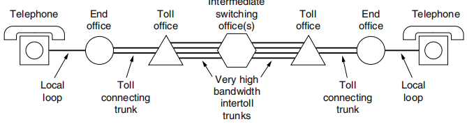

其中 end office 为端局，toll office 为长途局，二者间连接为中继线。

Full Duplex 全双工

### 2.4 从波形到比特*

**数字调制**

数据与代表它们的信号之间的转换过程称为数字调制（digital modulation）

**基带传输**

将基带信号直接传送到通信线路（数字线路）称为基带传输，调制后送到通信线路（模拟信道）称为频带传输。

**通带传输**

通过调节载波信号的幅值、相位或频率来运载数据，占据以载波信号频率为中心的一段频带，用于无线和光纤信道。

**多路复用**

PCM：脉冲编码调制

### 2.6 蜂窝网络（CDMA）

码分多址（CDMA, Code Division Multiple Access）是 3G 系统的基础。

## 第3章 数据链路层（小于10分）
### 3.1 数据链路层的设计问题（Framing）

一般情况下，数据链路层通常会提供以下 3 种可能的服务：

* 无确认的无连接服务；
* 有确认的无连接服务；
* 有确认的有连接服务。

注意没有有连接但无确认的服务，具体可以回顾 1.5 节相关内容。有连接即希望可靠服务，因此必须有确认。

### 3.2 错误检测和纠正（Hamming distance, CRC）

Hamming distance

* 设 $n$ 为有效信息位数，$k$ 为校验位位数，则有 $n+k \le 2^k-1$；
* 检错：检测 $d$ 位错需要码距 $d+1$；
* 纠错：纠正 $d$ 位错需要码距 $2d+1$；

### 3.4 滑动窗口协议

数据链路层可靠传输机制通过使用确认和超时重传两种机制完成。自动重传请求（ARQ，Automatic Repeat reQuest）通过接收方请求发送方重传出错的数据帧来恢复出错的帧。我们有以下三种 ARQ：

One-Bit Sliding Window Protocol 单帧滑动窗口协议（停止-等待协议 stop-and-wait）

* 发送窗口大小：1，接收窗口大小：1；
* 发送帧交替用 0 和 1 来标识，确认帧使用 ACK0 和 ACK1；
* 为了超时重发和判定重复帧需要，发送方和接收方都需要设置一个缓冲区。

Go-Back-N（GBN）后退 N 帧协议

* 发送窗口大小：$1 \le W_T \le 2^n-1$，接收窗口大小：1；
* 出现失序的信息帧后要求发送方重发最后一个正确接受的信息帧之后所有未被确认的帧；
* 可以在收到多个正确数据帧后确认（累积确认）或自己有数据发送时再带上确认帧一起发回（捎带确认 piggybacking），确认号 ACKn 表示收到第 n 号帧，期望收到 n + 1 号帧。

Selective Repeat 选择重传协议

* 发送窗口大小接收窗口大小之和不能超过 $2^n$，且发送窗口等于接受窗口，故二者最大均为 $2^{n-1}$；
* 可以收下不按序的序号，只需重发差错或超时的数据帧，因此无累积确认；
* 缓冲区大小等于窗口数目大小；
* 接收方怀疑帧出错，会发送否定帧 NAK 给发送方要求重传指定帧。

注意接受窗口大小为 1 可以保证按序接收。

## 第4章 介质访问控制子层（小于10分）
### 4.2 多路访问协议（MAC协议）

**CSMA（Carrier Sense Multiple Access 载波侦听多路访问，注意与码分复用 CDMA 区分）**

若每个站点发送前先侦听信道，发现信道空闲后再发送会大大降低冲突可能。CSMA 就是依据这一思想，它相对于 ALOHA 多了一个载波侦听装置。

有三种 CSMA 协议：

* 1-坚持 CSMA（1-persistent CSMA）：侦听信道空闲则立刻发送，冲突则继续坚持侦听直到空闲（持即续侦听信道直到空闲时立刻发出）；
* 非坚持 CSMA（Non-persistent CSMA）：侦听信道空闲则立刻发送，如果忙则放弃侦听，等待随机时间后再重复上述过程。这降低了多个结点同时等待信号空闲同时发送数据造成的冲突；
* $p$-坚持 CSMA（$p$-persistent CSMA）：侦听信道空闲则以概率 $p$ 立即发送，以概率 $1-p$ 推迟到下一个时隙，冲突则继续坚持侦听直到空闲，相当于前两种方案的折中。

**CSMA/CD（CSMA with Collision Detection 载波侦听多路访问/碰撞检测）**

1-坚持 CSMA 中传播延迟影响较大。结点 A 开始发送数据时，其发送数据的信号还未到达 B，B 侦听到信道空闲则发出，这样会导致冲突。于是 CSMA/CD 改为边发送边侦听。

要求帧的传输时长不小于 2 倍的传播时延（因为考虑往返），即：

最小帧长 = 2 $\times$ 总线传播延迟 $\times$ 数据传输速率（注意传输和传播的区别）

二进制指数退避算法（binary exponential back-off algorithm）

1. 确定基本退避时间，一般选取 2 倍总线端到端传播时延即 $2\tau$；
2. 从集合 $\{0,1,\cdots,2^k-1\}$ 中随机选择一个数 $r$，则退避时间为 $2r\tau$，其中 $k=\min\{重传次数，10\}$，即重传超过 10 次时 $k$ 不再增大，恒定为 10；
3. 当重传达到 16 次仍不成功则说明网络太拥挤，抛弃此帧并向高层报告出错。

**CSMA/CA（CSMA with Collision Avoidance 载波侦听多路访问/碰撞避免）**

无线局域网不能简单搬用 CSMA/CD，原因如下：

1. 无线网中接收信号强度远远小于发送信号强度，很难准确检测碰撞；
2. 无线通信中存在“隐蔽站”问题。

在这种情况下，我们采取冲突避免的方式，即发送数据前先广播告知其他节点。

802.11 要求发送方发送完一帧后，需收到对方确认后才能发送下一帧。并且为了避免碰撞，802.11 规定所有站完成发送后必须等待一段很短的时间（继续监听）才能发送下一帧，这段时间称为帧间间隔（InterFrame Space，IFS）。

处理隐蔽站问题：RTS 和 CTS（又称冲突避免多路访问 MACA，Multiple Access with Collision Avoidance）

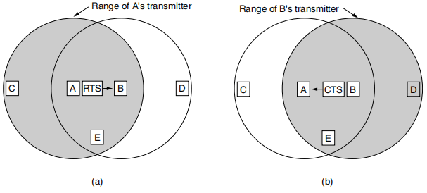

如图所示，对于（a），A 和 D 都能将数据发送给 B，且当 A 发送消息给 B 时，D 是无法听见的，因此 D 此时也可能给 B 发送数据，这时就会产生冲突。为了避免这种问题，我们引进 RTS（Request To Send）和 CTS（Clear To Send）帧，虑 当 A 向 B 发送一帧时的规则如下：

1. A 首先给 B 发送一个 RTS 帧，如图（a）所示。这个短帧（30 字节）包含了随后将要发送的数据帧的长度：
2. 然后，B 用一个 CTS 作为应答，如图（b ）所示。CTS 帧也包含了数据长度（从 RTS 帧中复制过来）；
3. A 在收到了 CTS 帧之后开始传输。

其他站听到了这些帧的反应（**注意区分不同情况下其他站在数据帧发送时能否发送数据**）：

1. 如果一个站听到了 RTS 帧，那么它一定离 A 很近，它必须保持沉默，至少等待足够长的时间以便在无冲突情况下 CTS 被返回给 A（只需等待 CTS 到达 A 即可，不影响后续数据传输）；
2. 如果一个站昕到了 CTS ，则它一定离 B 很近，在接下来的数据传送过程中它必须一直保持沉默，只要检查 CTS 帧，该站就可以知道数据帧的长度（即数据传输要持续多久）。

例如，①图中 C 落在 A 的范围内，但不在 B 的范围内。因此它听到了发出的 RTS 但没有听到  CTS，只要它没有干扰 CTS ，那么在之后的数据帧传送过程中，它可以自由地发送任何信息。②相反，D 落在 B 的范围内，但不在 A 的范围内。它听不到 RTS 帧但听到了CTS 帧，所以它就延缓发送任何信息直到数据帧如期传送完毕。③ E 站听到了这两条控制消息，一样在数据帧完成之前它必须保持安静。

尽管有了这些防范措施，冲突仍有可能会发生。例如， 可能同时给 B 发送 RTS 帧。这些帧将发生冲突，因而丢失。在发生了冲突的情况下，一个不成功的发送方（即在期望的时间间隔内没有听到 CTS）将等待一段随机的时间，以后再重试。

### 4.3 以太网*

在不考虑以太网前导码（preamble）的情况下：

* 以太网帧的最短为 64 字节，帧中的数据不得少于 46 个字节，以太网帧头有 18 字节，小于以上长度的帧或数据需要在帧中加入“填充数据（pad）”；
* 以太网帧的最长为 1518 字节。我们所说的 MTU  以太网一般为 1500，加上以太网帧头 18 字节。注意802.3 规范已经把最大长度改为 1536（即 0x0600）了。

注意 MAC 地址长度为 48 bits。

高速以太网：速率达到或超过 100Mb/s 的以太网，分类如下：

1. 100BASE-T 以太网：双绞线（T）
2. 吉比特以太网：千兆以太网
3. 10 吉比特以太网：只使用光纤作为传输媒体，只工作在全双工方式，因此没有争用问题，也不使用 CDMA/CD 协议。

### 4.7 数据链路层交换**

**网桥**

* 把更多的站放在一个以太网集线器或经典以太网内也不会增加容量。所有的站共享固定容量的带宽。连的站越多，每站获得的平均带宽越少。然而，两个独立的局域网有两倍于单个 LAN 的容量。网桥让局域网结合在一起，同时保持了这种容量；
* 后向学习算法：阻止不需要发送的流量，接收到一个包则记录端口和 MAC 地址的对应关系；
* 生成树算法：打破可能的环路（广播风暴），流程为选择具有最低标识符的网桥作为生成树的根，然后构造从根到每个网桥的最短路径树，如果最短路径祥同则选取经过具有最低标识符的网桥路径。

**Repeaters, Hubs, Bridges, Switches, Routers, and Gateways 中继器／集线器／网桥／交换机／路由器和网关**

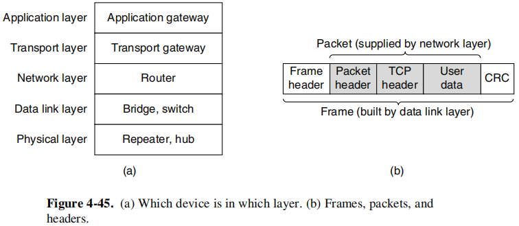

注意：交换机的每个端口都有各自的 MAC 地址。

**虚拟局域网 VLAN**

## 第5章 网络层（非常非常重要）
### 5.1 网络层的设计问题

两种常见的传输技术（transmission technology）：单播（unicasting，或称点到点（point-to-point）链路）和广播链路（broadcast links）。

### 5.2 单个网络中的路由算法
### 5.7 Internet的网络层**

**NAT 网络地址转换**

NAT 是指通过将专用网络地址转换为公用地址从而对外隐藏内部管理的 IP 地址。内部 IP 地址可重用，故 NAT 节省了对 IP 地址的消耗，并降低了内部网络受到攻击的风险。

私有 IP 地址（private IP address）网段如下：

1. A类：1 个 A 类网段 **10**.0.0.0-**10**.255.255.255
2. B 类：16 个 B 类网段 **172.16**.0.0-**172.31**.255.255
3. C类：256 个 C 类网段：**192.168.0**.0-**192.168.255**.255

**路由协议**

Internet 由大量的独立网络或自治系统（AS, Autonomous System）构成，并由不同的组织运营，这些组织通常是公司、大学或 ISP。在自己网络内部，一个组织可以使用自己的域内路由算法（intradomain routing），域内路由协议也称为内部网关协议（IGP，interior gateway protocol）。而域间路由（interdomain routing）问题中所有网络必须使用相同的域间路由协议和外部网关协议（EGP，exterior gateway protocol）。

RIP（Routing Information Protocol，路由信息协议）

采用距离矢量路由（distance vector routing）算法

OSPF（ Open Shortest Path First，开放最短路径优先）

采用链路状态路由算法（link state routing）

BGP（Border Gateway Protocol，边界网关协议）

采用路径矢量协议（path vector protocol）

## 第6章 传输层（非常重要）
### 6.1 传输服务

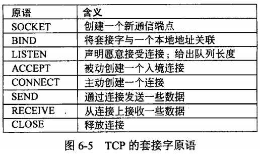

### 6.2 传输协议的要素
### 6.4 Internet传输协议: UDP

使用 UDP 总结：

DHCP、DNS、RIP、实时传输协议（Real-time Transport Protocol，RTP）

注意端口号长度为 2 bytes（16 bits）

UDP 校验和需要添加伪首部并尾部填充保证总字节数为偶数，然后校验需要检查首部和数据部分，TCP 也是如此，这不同于 IP 只校验头部。

### 6.5 Internet传输协议: TCP

注意两个重要概念：

* **MSS（Maximum Segment Size）**：TCP一次传输发送的最大数据段长度。
* **RTT（Round-Trip Time）**：往返时延，表示从发送端发送数据开始，到发送端收到来自接收端的确认（接收端收到数据后便立即发送确认），总共经历的时延。

**常见的使用 TCP 的协议**

Telnet（Internet远程登录服务的标准协议和主要方式。它为用户提供了在本地计算机上完成远程主机工作的能力，TCP Port 23）、BGP、POP3、SMTP、IMAP、HTTP、FTP。

**一些 TCP 的知名端口（well-known port ）**

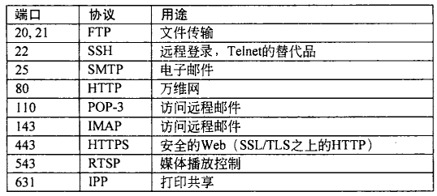

特别注意 TCP 的确认号是希望收到的下一个字节序号，不是滑动窗口 GBN 中目前收到的序号。

**TCP 流量控制**

通过一个可变大小的滑动窗口处理。窗口大小（Window size）字段指定了从被确认的字节算起可以发送多少个字节。

**TCP 拥塞控制**

慢开始和拥塞避免（TCP Tahoe），超时重传后，cwnd设置为1个MSS

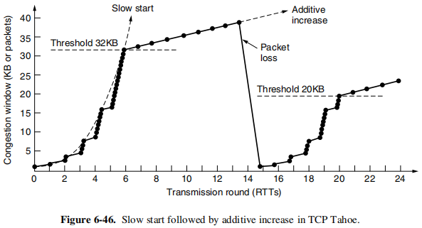

快重传（利用冗余 ACK）和快恢复（TCP Reno）

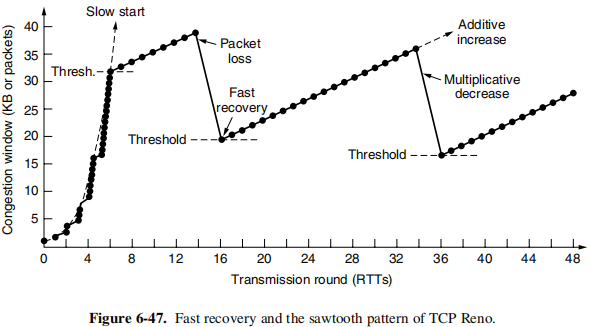

注意区分流量控制和拥塞控制，并且发送窗口取接收窗口（流量控制）和拥塞窗口（拥塞控制）中的最小值。

## 第7章 应用层（小于10分）
### 7.1 DNS——域名系统

**DNS 资源记录（resource record）**

* 格式为 Domain name 域名  Time to live 生存期  Class 类别  Type 类型  Value 值
* 域名：不一定需要包含 www；
* 生存期：指明了该条记录的稳定程度。极为稳定的信息会被分配一个很大的值，比如 86400（l 天的秒数〉，而非常不稳定的信息则会被分配一个较小的值，比如 60（l 分钟的秒数〉；
* 类别：对于 Internet 信息，它总是 IN 。对于非 Internet 信息，则可以使用其他的代码，但实际上很少见；
* 类型：如图所示

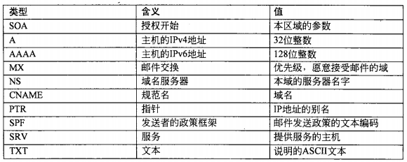

* 值：该字段的值可以是一个数字、一个域名或者一个 ASCII 字符串，其语义取决于记录的类型（详见上图中的描述）。

注意无论采取迭代查询还是递归查询，主机都只向本地域名服务器发请求，接下来本地域名服务器完成递归或迭代的任务。

### 7.2 电子邮件

**SMTP（Simple Mail Transfer Protocol，简单邮件传输协议）**

* TCP 端口号 25；
* 从用户代理到发送方邮件服务器，以及邮件服务器之间传送都是基于 SMTP（push）；

**MIME（Multipurpose Internet Mail Extensions，多用途网络邮件扩充）**

* RFC 5322 是 Internet 邮件格式的最新版本，最初的 Internet 邮件格式由 RFC 822 描述；
* 继续使用 RFC 822 格式（在 RFC 5322 之前 MIME 就己被提出），但在邮件体中增加了结构性，并且为传送非 ASCII 码（基础的只能传送 ASCII 码）的邮件定义了编码规则，以下是 MIME 支持的内容类型：

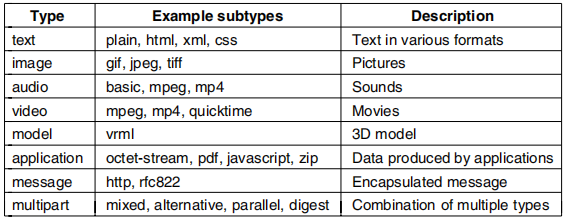

* MIME 主要包括以下三部分内容：① 5 个新的邮件首部字段，包括 MIME 版本（MIME-Version）、内容描述（Content-Description）、内容标识（Content-ld）、传送编码（Content-Transfer-Encoding）和内容类型（Content-Type）；②定义了许多邮件内容的格式，对多媒体电子邮件的表示方法进行了标准化；③定义了传送编码，可对任何内容格式进行转换，而不会被邮件系统改变。

**POP3（Post Office Protocol，邮局协议）**

* TCP 端口号 110；
* 用户读取文件时，用户代理向邮件服务器发出请求（pull）；
* 两种工作方式：下载并保留（用户可以再次读取邮件），下载并删除（读取后邮件服务器删除该邮件）。

**IMAP（Internet Message Access Protocol，因特网报文存取协议）**

* TCP 端口号 143 ；
* 用户读取文件时，用户代理向邮件服务器发出请求（pull）；
* 功能比 POP 复杂，用户可以执行很多命令，包括列表显示文件夹和邮件、获取邮件或者甚至部分邮件、给邮件标记供以后删除，并将邮件组织到各文件夹内，也可以不通过邮件号而是使用属性来寻址邮件。

**Webmail 网络邮件**

一种日益流行可提供电子邮件服务的是 Web，它利用 Web 为用户提供邮件服务。浏览器与邮件服务器之间采用 HTTP 协议接收发送邮件，不同邮件服务器之间使用 SMTP。

### 7.3 万维网（web, url, cookie, javascript, php）

HTTP：无连接（无需建立 HTTP 连接），无状态（不会记录曾经访问过的客户），HTTP/1.1 默认持久连接（persistent connection）

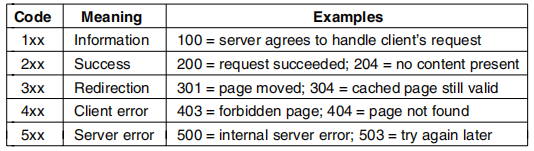

上表为 HTTP 状态码示例，1×× 码实际上很少被使用，2×× 码意味着这个请求被成功地处理，并且返回了相应的内容〈如果有的话〉，3×× 码告诉客户应该检查其他地方，使用另一个不同的 URL 或在它自己的缓存中查找，4×× 码意味着由于客户错误而导致请求失败，比如无效请求或者不存在的页面，最后 5×× 错误码意味着服务器自身出现内部问题，有可能是服务器代码中有错误，也可能是临时负载过重。

**超文本标记语言（HTML，HyperText Markup Language）**

**统一资源定位符（URL，Uniform Resource Locator ）**

如果每个页面都以某种方式被分配了一个唯一的名字，那么在标识页面时就不会存在任何歧义。URL 包括 3 个部分：协议（也称为方案（scheme 》、页面所在机器的 DNS 名字，以及唯一指向特定页面的路径〈通常是读取的一个文件或者运行在机器上的个程序〉。如何解释路径服务器的事，路径可能反映了实际的目录结构，也可能不反映实际的目录结构。

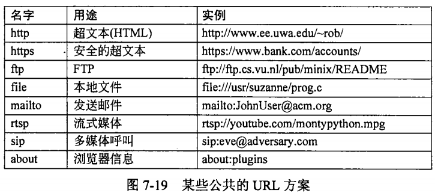

**Cookie**

**CDN（Content Delivery Network）内容分发网络**

其基本思路是尽可能避开互联网上有可能影响数据传输速度和稳定性的瓶颈和环节，使内容传输得更快、更稳定。通过在网络各处放置节点服务器所构成的在现有的互联网基础之上的一层智能虚拟网络，CDN 系统能够实时地根据网络流量和各节点的连接、负载状况以及到用户的距离和响应时间等综合信息将用户的请求重新导向离用户最近的服务节点上。其目的是使用户可就近取得所需内容，解决 Internet 网络拥挤的状况，提高用户访问网站的响应速度。

**动态 Web 页面和 Web 应用**

**服务器端**动态 Web 页面生成

1. 第一种处理动态页面请求的方法称为公共网关接口（ CGI, Common Gateway Interface)。CGI 提供了一个接口，允许 Web 服务器与后端程序及脚本通信：这些后端程序和脚本接受输入信息（例如表单），并生成 HTML 页面作为响应；
2. 第二种方法是在 HTML 页面中嵌入少量的脚本，然后让**服务器**来执行这些脚本以便生成最终发送给客户的页面。编写这些脚本的一种流行语言是超文本预处理器（PHP, Hypertext Preprocessor ）。服务器用文件扩展名 php 来标识包含 PHP Web 页面，而不是用 html 或者 htm 扩展名。

**客户端**动态 Web 页面生成

在HTML 页面中嵌入脚本，而且这些**脚本必须运行在客户机上而不是在服务器上**。从 HTML 4.0 开始，可以通过 \<script\> 标签来启用这样的脚本。用来产生这种交互式 Web 页面的技术统称为动态 HTML（dynamic HTML）。最流行的客户端脚本语言是 JavaScript。

JavaScript & PHP

PHP 和 JavaScript 看上去很相似，它们都是嵌入在 HTML 文件中的代码，但它们的处理方式完全不同。

* PHP：当用户单击了 submit按钮后，浏览器将表单中的信息收集到一个长字符串中，然后将它发送给服务器请求一个 PHP 页面。服务器加载该 PHP 文件，并且执行内嵌的 PHP 脚本，由此产生一个新的页面。然后该页面被送回给浏览器以便显示出来。浏览器不能确定这是由一个程序生成的；
* JavaScript：当用户点击 submit 按钮，浏览器就解释该页面中包含的一个 JavaScript 函数。所有的工作都在本地完成，即在浏览器内部完成。这时没有与服务器取得任何联系。因此结果几乎在瞬间就显示出来，而用 PHP 生成的 HTML 在到达客户端之前可能有几秒钟的延迟。

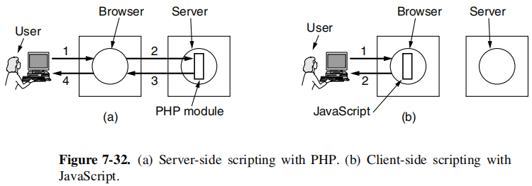
