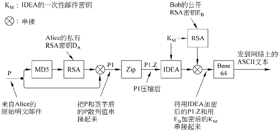
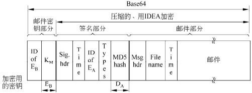

# 2022-2023 学年 秋冬学期 期末复习

本页面针对 2022-2023 学年 zkg 老师划定的范围进行复习，其他内容因时间关系不详细展开。以下目录基于《计算机网络》（第六版）[美] Andrew S. Tanenbaum 等 著。

## 第一章 引言（小于10分）

### 1.5 网络协议

### 1.6 参考模型（OSI）*

## 第2章 物理层（小于10分）
### 2.1 导向的传输介质

注意区分 S/N ratio 和以 dB 为单位的两种信噪比，前者就是 S/N，后者是 10$\log_{10}$S/N。

UTP：非屏蔽双绞线

semiconductor laser：半导体激光

注意区分 data transfer rate 数据传输速率和 signal propagation rate 信号传播速率，前者指数据发送到链路上的速率，单位为 b/s，后者指在链路上的传播速率（如电磁波在真空中传播速率为光速），单位 m/s。**计算数据传输速率要特别注意不要混淆 byte 和 bit，然后注意文件大小 K，M 等是以 2 为底的指数，传输速率是以 10 为底的指数。

下图为电话网络的基本结构：

其中 end office 为端局，toll office 为长途局，二者间连接为中继线。

Full Duplex 全双工

### 2.4 从波形到比特*

PCM：脉冲编码调制

### 2.6 蜂窝网络（CDMA）

码分多址（CDMA, Code Division Multiple Access）是 3G 系统的基础。

数据交换的几种方式：

* 电路交换 circuit switching：数据传输前，两个节点之间必须先建立一条专用（双方独占）的物理通信路径，分为三个阶段：连接建立-数据传输-连接释放；
* 报文交换 message switching：数据交换的单位是报文，在交换节点采用存储转发方式传输；
* 分组交换 package switching：包括虚电路 virtual circuit 和数据报 data gram。同样采用存储转发模式，但限制每次传送的数据块大小上限，将大的数据块划分为合理的的小数据块，再加上必要控制信息构成分组（packet）。数据报不保证可靠性，分组不一定有序到达，虚电路将数据报和电路交换结合，在通信双方之间里逻辑线路，数据分组需要有分组号、校验号和虚电路号等，提供可靠通信功能，保证每个分组正确且有序到达。

## 第3章 数据链路层（小于10分）
### 3.1 数据链路层的设计问题（Framing）
### 3.2 错误检测和纠正（Hamming distance, CRC）
### 3.4 滑动窗口协议

数据链路层可靠传输机制通过使用确认和超时重传两种机制完成。自动重传请求（ARQ，Automatic Repeat reQuest）通过接收方请求发送方重传出错的数据帧来恢复出错的帧。我们有以下三种 ARQ：

One-Bit Sliding Window Protocol 单帧滑动窗口协议（停止-等待协议 stop-and-wait）

* 发送窗口大小：1，接收窗口大小：1；
* 发送帧交替用 0 和 1 来标识，确认帧使用 ACK0 和 ACK1；
* 为了超时重发和判定重复帧需要，发送方和接收方都需要设置一个缓冲区。

Go-Back-N（GBN）后退 N 帧协议

* 发送窗口大小：$1 \le W_T \le 2^n-1$，接收窗口大小：1；
* 出现失序的信息帧后要求发送方重发最后一个正确接受的信息帧之后所有未被确认的帧；
* 可以在收到多个正确数据帧后确认（累积确认）或自己有数据发送时再带上确认帧一起发回（捎带确认 piggybacking），确认号 ACKn 表示收到第 n 号帧，期望收到 n + 1 号帧。

Selective Repeat 选择重传协议

* 发送窗口大小接收窗口大小之和不能超过 $2^n$，且发送窗口等于接受窗口，故二者最大均为 $2^{n-1}$；
* 可以收下不按序的序号，只需重发差错或超时的数据帧，因此无累积确认；
* 缓冲区大小等于窗口数目大小；
* 接收方怀疑帧出错，会发送否定帧 NAK 给发送方要求重传指定帧。

注意接受窗口大小为 1 可以保证按序接收。

## 第4章 介质访问控制子层（小于10分）
### 4.2 多路访问协议（MAC协议）

**CSMA（Carrier Sense Multiple Access 载波侦听多路访问，注意与码分复用 CDMA 区分）**

若每个站点发送前先侦听信道，发现信道空闲后再发送会大大降低冲突可能。CSMA 就是依据这一思想，它相对于 ALOHA 多了一个载波侦听装置。

有三种 CSMA 协议：

* 1-坚持 CSMA（1-persistent CSMA）：侦听信道空闲则立刻发送，冲突则继续坚持侦听直到空闲（持即续侦听信道直到空闲时立刻发出）；
* 非坚持 CSMA（Non-persistent CSMA）：侦听信道空闲则立刻发送，如果忙则放弃侦听，等待随机时间后再重复上述过程。这降低了多个结点同时等待信号空闲同时发送数据造成的冲突；
* $p$-坚持 CSMA（$p$-persistent CSMA）：侦听信道空闲则以概率 $p$ 立即发送，以概率 $1-p$ 推迟到下一个时隙，冲突则继续坚持侦听直到空闲，相当于前两种方案的折中。

**CSMA/CD（CSMA with Collision Detection 载波侦听多路访问/碰撞检测）**

1-坚持 CSMA 中传播延迟影响较大。结点 A 开始发送数据时，其发送数据的信号还未到达 B，B 侦听到信道空闲则发出，这样会导致冲突。于是 CSMA/CD 改为边发送边侦听。

要求帧的传输时长不小于 2 倍的传播时延（因为考虑往返），即：

最小帧长 = 2 $\times$ 总线传播延迟 $\times$ 数据传输速率（注意传输和传播的区别）

二进制指数退避算法（binary exponential back-off algorithm）

1. 确定基本退避时间，一般选取 2 倍总线端到端传播时延即 $2\tau$；
2. 从集合 $\{0,1,\cdots,2^k-1\}$ 中随机选择一个数 $r$，则退避时间为 $2r\tau$，其中 $k=\min\{重传次数，10\}$，即重传超过 10 次时 $k$ 不再增大，恒定为 10；
3. 当重传达到 16 次仍不成功则说明网络太拥挤，抛弃此帧并向高层报告出错。

**CSMA/CA（CSMA with Collision Avoidance 载波侦听多路访问/碰撞避免）**

无线局域网不能简单搬用 CSMA/CD，原因如下：

1. 无线网中接收信号强度远远小于发送信号强度，很难准确检测碰撞；
2. 无线通信中存在“隐蔽站”问题。

在这种情况下，我们采取冲突避免的方式，即发送数据前先广播告知其他节点。

802.11 要求发送方发送完一帧后，需收到对方确认后才能发送下一帧。并且为了避免碰撞，802.11 规定所有站完成发送后必须等待一段很短的时间（继续监听）才能发送下一帧，这段时间称为帧间间隔（InterFrame Space，IFS）。

处理隐蔽站问题：RTS 和 CTS（又称冲突避免多路访问 MACA，Multiple Access with Collision Avoidance）

如图所示，对于（a），A 和 D 都能将数据发送给 B，且当 A 发送消息给 B 时，D 是无法听见的，因此 D 此时也可能给 B 发送数据，这时就会产生冲突。为了避免这种问题，我们引进 RTS（Request To Send）和 CTS（Clear To Send）帧，虑 当 A 向 B 发送一帧时的规则如下：

1. A 首先给 B 发送一个 RTS 帧，如图（a）所示。这个短帧（30 字节）包含了随后将要发送的数据帧的长度：
2. 然后，B 用一个 CTS 作为应答，如图（b ）所示。CTS 帧也包含了数据长度（从 RTS 帧中复制过来）；
3. A 在收到了 CTS 帧之后开始传输。

其他站听到了这些帧的反应（**注意区分不同情况下其他站在数据帧发送时能否发送数据**）：

1. 如果一个站听到了 RTS 帧，那么它一定离 A 很近，它必须保持沉默，至少等待足够长的时间以便在无冲突情况下 CTS 被返回给 A（只需等待 CTS 到达 A 即可，不影响后续数据传输）；
2. 如果一个站昕到了 CTS ，则它一定离 B 很近，在接下来的数据传送过程中它必须一直保持沉默，只要检查 CTS 帧，该站就可以知道数据帧的长度（即数据传输要持续多久）。

例如，①图中 C 落在 A 的范围内，但不在 B 的范围内。因此它听到了发出的 RTS 但没有听到  CTS，只要它没有干扰 CTS ，那么在之后的数据帧传送过程中，它可以自由地发送任何信息。②相反，D 落在 B 的范围内，但不在 A 的范围内。它听不到 RTS 帧但听到了CTS 帧，所以它就延缓发送任何信息直到数据帧如期传送完毕。③ E 站听到了这两条控制消息，一样在数据帧完成之前它必须保持安静。

尽管有了这些防范措施，冲突仍有可能会发生。例如， 可能同时给 B 发送 RTS 帧。这些帧将发生冲突，因而丢失。在发生了冲突的情况下，一个不成功的发送方（即在期望的时间间隔内没有听到 CTS）将等待一段随机的时间，以后再重试。

### 4.3 以太网*

在不考虑以太网前导码（preamble）的情况下：

* 以太网帧的最短为 64 字节，帧中的数据不得少于 46 个字节，以太网帧头有 18 字节，小于以上长度的帧或数据需要在帧中加入“填充数据（pad）”；
* 以太网帧的最长为 1518 字节。我们所说的 MTU  以太网一般为 1500，加上以太网帧头 18 字节。注意802.3 规范已经把最大长度改为 1536（即 0x0600）了。

高速以太网：速率达到或超过 100Mb/s 的以太网，分类如下：

1. 100BASE-T 以太网：双绞线（T）
2. 吉比特以太网：千兆以太网
3. 10 吉比特以太网：只使用光纤作为传输媒体，只工作在全双工方式，因此没有争用问题，也不使用 CDMA/CD 协议。

### 4.7 数据链路层交换**

交换机的每个端口都有各自的 MAC 地址。

## 第5章 网络层（非常非常重要）
### 5.1 网络层的设计问题

两种常见的传输技术（transmission technology）：单播（unicasting，或称点到点（point-to-point）链路）和广播链路（broadcast links）。

### 5.2 单个网络中的路由算法
### 5.7 Internet的网络层**

**NAT 网络地址转换**

NAT 是指通过将专用网络地址转换为公用地址从而对外隐藏内部管理的 IP 地址。内部 IP 地址可重用，故 NAT 节省了对 IP 地址的消耗，并降低了内部网络受到攻击的风险。

私有 IP 地址（private IP address）网段如下：

1. A类：1 个 A 类网段 **10**.0.0.0-**10**.255.255.255
2. B 类：16 个 B 类网段 **172.16**.0.0-**172.31**.255.255
3. C类：256 个 C 类网段：**192.168.0**.0-**192.168.255**.255

**路由协议**

Internet 由大量的独立网络或自治系统（AS, Autonomous System）构成，并由不同的组织运营，这些组织通常是公司、大学或 ISP。在自己网络内部，一个组织可以使用自己的域内路由算法（intradomain routing），域内路由协议也称为内部网关协议（IGP，interior gateway protocol）。而域间路由（interdomain routing）问题中所有网络必须使用相同的域间路由协议和外部网关协议（EGP，exterior gateway protocol）。

RIP（Routing Information Protocol，路由信息协议）

采用距离矢量路由（distance vector routing）算法

OSPF（ Open Shortest Path First，开放最短路径优先）

采用链路状态路由算法（link state routing）

BGP（Border Gateway Protocol，边界网关协议）

采用路径矢量协议（path vector protocol）

## 第6章 传输层（非常重要）
### 6.1 传输服务
### 6.2 传输协议的要素
### 6.4 Internet传输协议: UDP

实时传输协议（Real-time Transport Protocol，RTP）

### 6.5 Internet传输协议: TCP

Telnet协议是TCP/IP 协议族中的一员，是Internet远程登录服务的标准协议和主要方式。它为用户提供了在本地计算机上完成远程主机工作的能力。（TCP Port 23）

特别注意 TCP 的确认号是希望收到的下一个字节序号，不是滑动窗口 GBN 中目前收到的序号。

## 第7章 应用层（小于10分）
### 7.1 DNS——域名系统

**DNS 资源记录（resource record）**

* 格式为 Domain name 域名  Time to live 生存期  Class 类别   Type 类型  Value 值 

注意无论采取迭代查询还是递归查询，主机都只向本地域名服务器发请求，接下来本地域名服务器完成递归或迭代的任务。

### 7.2 电子邮件

SMTP 端口号 25，POP3 端口号 110

### 7.3 万维网（web, url, cookie, javascript, php）

HTTP：无连接（无需建立 HTTP 连接），无状态（不会记录曾经访问过的客户），HTTP/1.1 默认持久连接（persistent connection）

CDN（Content Delivery Network）内容分发网络

其基本思路是尽可能避开互联网上有可能影响数据传输速度和稳定性的瓶颈和环节，使内容传输得更快、更稳定。通过在网络各处放置节点服务器所构成的在现有的互联网基础之上的一层智能虚拟网络，CDN 系统能够实时地根据网络流量和各节点的连接、负载状况以及到用户的距离和响应时间等综合信息将用户的请求重新导向离用户最近的服务节点上。其目的是使用户可就近取得所需内容，解决 Internet 网络拥挤的状况，提高用户访问网站的响应速度。

## 第8章 网络安全（小于10分）

本章内容不作重点考察，只记录大致内容。

### 8.4 密码学+

置换密码：凯撒密码，简单的字母替换；

替代密码：重新排序，不伪装明文，例如列换位密码，书写秘钥后，下方对齐秘钥逐行书写明文，最后根据秘钥中字母顺序重新排序各列；

一次性秘钥：随机位串与明文异或，量子密码（如 BB84）可以实现一次性秘钥传输问题。

### 8.5 对称密钥算法++

**密码模式**

尽管 AES 算法（或者 DES，或者其他任何块密码算法）如此复杂，但本质上只是一种单字母置换密码算法，只不过使用了极大的字符（对于 AES 为 128 位字符，对于 DES 为 64 位字符）。于是你用同样的 DES 密钥加密明文 abcdefgh 100 次，那么你就会得到同样的密文 100 次。入侵者可以充分发掘这种特性来协助攻破整个密码系统。

电码本模式（ECB，Electronic Code Book mode）

密码块链模式（cipher block chaining mode）

对抗这种类型的攻击，所有的块密码算法可以按各种不同的方式链接起来。

密码反馈模式（cipher feedback mode）

流密码模式（stream cipher mode）

计数器模式（counter mode）

### 8.6 公钥算法++
### 8.7 数字签名+

注意公私钥加密解密：

1. A 给 B 发送加密消息：A 使用 B 的公钥加密，B 使用 B 的私钥解密；
2. B 给 A 回信采用数字签名：B 先使用 Hash 函数生成摘要（digest），然后 B 使用 B 的私钥加密生成数字签名（signature），签名附在信件后；A 收到后用 B 的公钥解密，并生成摘要进行比对验证。

### 8.8 公钥管理

公钥密码体系获得他人的公钥不一定可靠，可能被其他人篡改，因此需要证书体系。

* CA（Certificate Authority，证书中心）发放证书（CA 可以有层次）
* CA 使用自己的私钥对对证书的 SHA-1 散列值进行签名
* 接收方使用 CA 的公钥进行签名验证
* X.509 为证书格式

### 8.9 认证协议++
### 8.10 通信安全+
### 8.11 电子邮件安全+（PGP）

PGP（Pretty Good Privacy）-良好的隐私性

* 使用块密码算法 IDEA 国际数据加密算法加密数据，IDEA 类似于 DES / AES，允许多轮，但混合函数不一样。
* 密钥管理使用 RSA，数据完整性使用 MD5。

基本流程图如下：

Alice 调用她自己机器上的 PGP 程序：

1. 使用 MD5 算法对消息 P 做散列运算，然后用 Alice 的 RSA 私钥 $D_A$加密此结果散列值；
2. 经过加密的散列值和原始消息 P 被串接成单条消息 P1，并且使用 ZIP 程序压缩（Ziv-Lempel 算法），压缩结果称为 P1.Z；
3. 接下来，PGP 提示 Alice 输入一些随机信息。输入的容和敲键速度被用来生成一个 128 位的 IDEA 邮件密钥 KM，按照密码反馈模式，利用 IDEA 算法和 KM 来加密 P1.Z。另外，使用 Bob 的公钥 $E_B$来加密 KM；
4. 然后两部分内容被串接，并转换成 base64 编码。结果邮件只包含字母、数字和符号 +、/ 和 =，这意味着该邮件可以被放到一个 RFC 822 邮件体中，有望未被修改地到达另一方。

当 Bob 得到此邮件时，他做一个逆向的 base64 编码，并且利用他自己的 RSA 私钥解密出 IDEA 密钥。利用这个密钥，他解密此邮件得到 P1.Z；再经过解压缩，Bob 将明文与加密的散列值分离开，并且使用 Alice 的公钥解密此散列值。如果得到的明文散列值与他自己计算的 MD5 散列值一致，那么，他知道 P 是正确的邮件，而且它确实来自于 Alice。

PGP 支持 4 种 RSA 密钥长度。它可以由用户选择一种最为合适的长度。这些长度选 项是： （1）临时的（384 位）：今天很容易被破解；（2）商用的（512 位）：可被三字母组织破解；（3）军用的（1024 位）：地球上的任何人都无法破解；（4）星际的（2048 位）：其他行星上的任何人也无法破解。

由于 RSA 仅仅被用在两个小的计算过程（加密 128 位的 MD5 散列值和加密 128 位 IDEA 密钥）中，所以，每个人在任何时候都应该使用星际强度的密钥。

经典 PGP 消息的格式如图所示，可以对照流程进行理解：

PGP 的密钥管理模型：

每个用户在本地维护两个数据结构：一个私钥环和一个公钥环。

* 私钥环（private key ring）包含一个或者多个本人的“公钥/私钥”对。每一对“公钥/私钥”都有一个标识符与其关联，该标识符由公钥的低 64 位构成，所以邮件发送方可以告诉接收者自己是使用哪一个公钥来对它加密的。

* 公钥环（public key ring）包含了与当前用户通信的其他用户的公钥。公钥环上的每个条目不仅包含了公钥，而且也包含它的 64 位标识符，以及一个代表用户信任此密钥的强烈程度的指示值。
* 在 X.509 被标准化以后，PGP 除了支持传统的 PGP 公钥环机制以外，也支持X.509 证书。所有当前的 PGP 版本都支持 X.509。

S/MIME：略

### 8.12 Web安全+

**安全命名**

DNS 欺骗（DNS spoofing）：C 攻破 A 的 ISP 上的 DNS 缓存，将 B 的条目替换为自己的。做法是向 A 的 DNS 服务器请求 B 的条目（缓存中应没有 B 的条目，否则需要等待或运用其他高级手段），然后将预先准备好的伪造 UDP 答复先于真实的答复返回给 DNS 服务器即可产生错误的条目，得到染毒缓存（poisoned cache）。

DNS 安全（DNSsec，DNS Security）

实际上上述攻击并非这么简单，因为 DNS 回复需要检查需要，C 必须通过一定方法知道序号。实际上 C 是可以做到这一点的，因为 DNS 序号是递增的，因此j将这一序号随机处理就可以解决一定的问题。

当然 DNSsec 采取了更多的手段，它利用公钥技术①证明数据从哪里来；②分发公钥；③认证事务和请求。

**SSL**—**安全套接层**

SSL 在两个套接字之间建立一个安全的连接，其中包括以下功能：（1）客户与服务器之间的参数协商；（2）客户和服务器的双向认证；（3）保密的通信；（4）数据完整性保护。

SSL 安全层位于应用层和传输层之间，SSL 之上的 HTTP 称为 HTTPS，有时使用端口 443。

**移动代码安全性**

现在，Web 页面通常包含小程序，例如 Java Applet、ActiveX 控件和 JavaScript 等。下载并执行这样的移动代码（mobile code）很显然存在极大的安全风险。

Java小程序（Java Applet）

 Java 小程序插入到浏览器内部 JVM 解释器中。在经过编译的代码上再来运行解释性代码的好处是，解释器在执行每一条指令之前可以先对指令进行检查。解释器可能要将不可信任的 Java 小程序（比如它通过 Internet 进入本地机器）封装到一个沙箱（sandbox）中以便限制它的行为，并捕捉住它使用系统资源的企图。

ActiveX 

ActiveX 控件是可以被嵌入到 Web 页面中的 x86 二进制程序。当浏览器遇到一个 ActiveX 控件时，它就要对该控件进行基于代码签名（code signing）的检查。每个 ActiveX 控件都有一个利用公钥对代码散列值进行的数字签名。浏览器首先验证该控件的签名，签名正确则检查它的内部表，看该程序的创建者是否可信，或是否存在一条信任链可以回溯到某个可信的创建者。创建者可信则程序被执行；否则不予执行。Microsoft 用来验证 ActiveX 控件的系统称为认证码（Authenticode）。

对比 Jave 和 ActiveX。若采用 Java 方法，用户无法确定一个 Java 小程序是谁写的；但运行时解释器可以保证这个 Java 小程序不会做出该机器主人明确指明不允许做的事情。与此相反，若采用代码签名的方法，则浏览器不可能监视移动代码运行时的行为。

JavaScript 

JavaScript 没有任何正式的安全模型，但是却有很长的安全泄漏历史。基本的问题是让外部代码在你的机器上运行，这等于在自找麻烦。

浏览器扩展（Browser Extensions）

是用来扩展 Web 浏览器的计算机程序，提供了解释或者显示一定类型内容的能力，例如 PDF 或者 Flash 动画。安装浏览器扩展、外接附件或插件将使代码穿过 Internet 被下载和安装在浏览器上，如果安装的代码有问题，整个浏览器都将受到损害。

病毒（Viruses）

病毒与普通移动代码之间的区别在于病毒具有繁殖能力，它通常首先会感染硬盘上的可执行程序。当被感染的程序运行起来时，控制权被传递给病毒，它通常试图将自己传播到其他的机器。

