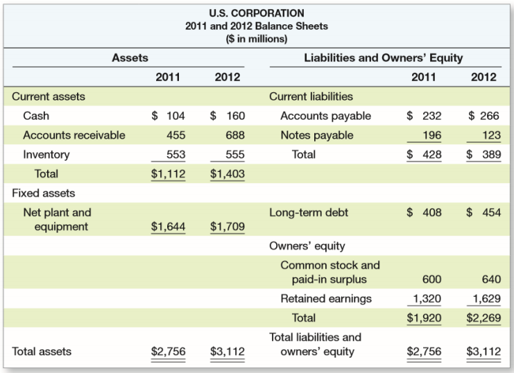
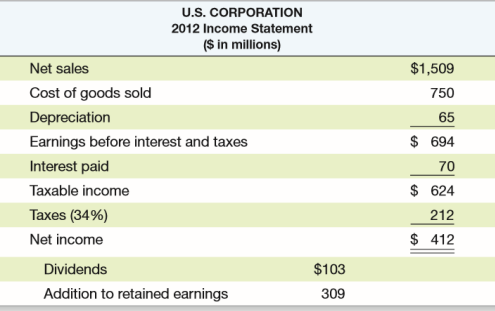
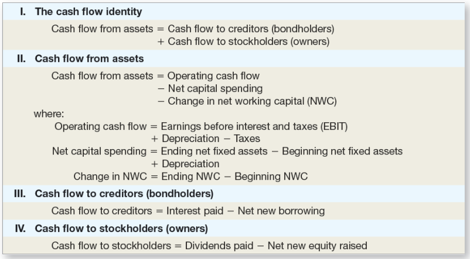
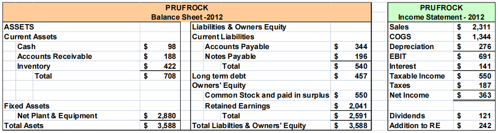

# 财务报表

## 第二章 Financial Statements and Cash Flow

财务报表与现金流量

本章主要介绍资产负债表和利润表以及其中出现的一些基本概念。

### The Balance Sheet 资产负债表

* 会计对公司在特定时间点的会计价值的快照
* 资产负债表的恒等式：Assets 资产 ≡ Liabilities 负债 + Stockholder's Equity 股东权益

上表为资产负债表的一个例子，其中资产位于表格左侧，负债位于右上方，股东权益位于右下方。不难发现这张表符合恒等式要求，左边资产总量等于右边负债与股东权益总和。

资产包括短期资产和长期资产：

* 短期资产包括Cash 现金及其等价物（如金融资产），Accounts receivable 应收款项（他人购买商品未付的款项）和 Inventory 库存；
* 长期资产包括 Net plant and equipment 净厂房与设备。

负债包含短期负债和长期负债，其中短期负债包括 Accounts payable 应付账款（欠供货商）和 Notes payable 应付票据（应付票据是一种法律票据，在这种票据中，一方书面承诺支付一定数额的钱给票据持有人）。

股东权益包含两个方面，一个是 Common stock and paid-in surplus 普通股票与实缴盈余（通俗理解为股东买股份的钱），还有一部分是 Retained earnings 留存收益，即赚的钱中没有分红的部分。

### The Income Statement 利润表

* 衡量在特定时间段内的财务业绩
* 收入的会计定义是：Revenue 收入 - Expenses 支出 ≡ Income 收入

由上表我们可以得到如下四个等式；

1. Net sales 净销售额 - Cost of goods sold 售出商品成本 - Depreciation 折旧 = Earnings before interest and taxes EBIT 息税（利息和税务）前利润
2. Earnings before interest and taxes EBIT 息税前利润 - Interest paid 支付利息 = Taxable income 应税所得
3. Taxable income 应税所得 - Taxes 缴税 = Net income 净收入
4. Net income 净收入 - Dividends 股息 = Addiction to retained earnings 留存收益

### Taxes 税

税总是在改变的。我们首先引入边际税率与平均税率的概念：

* Marginal tax rates 边际税率——下一美元收入需要缴税的百分比
* Average tax rates 平均税率——税额（tax bill） / 应税收入（Taxable income）

### Net Working Capital 净营运资本

公式：Net Working Capital 净营运资本 = Current Assets 短期资产 – Current Liabilities 短期负债

当短期资产大于短期负债时，净营运资本为正。这意味着未来 12 个月可获得的现金将大于必须支付的现金。除了投资于固定资产（即 capital spending 资本支出）外，公司还可以投资于净营运资本。这被称为净营运资本的变化（change in net working capital）。

### Financial Cash Flow 财务现金流量

Cash flow from assets (CF(A)) 资产现金流量：包含三个部分

1. Operating cash flow 经营现金流量
2. Net capital spending 净资本支出 
3. Change in net working capital 净营运资本变化

CFFA = 自由现金流，是指公司可以自由分配给债权人和股东的现金，因为它不在营运资本（working capital）或固定资产投资（fixed asset investments）中。实际上 CFFA 与 CF(A) 一致，故计算公式为

$$\textup{CFFA = OCF - NCS - }\Delta \textup{NWC}$$

这一公式中的三项需要单独拆解说明计算公式：

1. OCF=Earnings before interest and taxes EBIT 息税前利润 + Depreciation 折旧 - Taxes 缴税，原因在于折旧不是现金流，因此需要加回来，而利息本身就是给债权人的，因此无需减去；或 OCF = Net sales 净销售额 - Cost of goods sold 售出商品成本 - Taxes 缴税
2. NCS = Ending net fixed assets 最终的固定资产 - Beginning net fixed assets 最初的固定资产 + Depreciation 折旧
3. $\Delta$NWC = Ending NWC - Beginning NWC

资产负债表恒等式告诉我们，公司资产中获得的现金流必须等于公司与债权人和股东间的现金流：

$$\textup{CF(A) ≡ CF(B) + CF(S)}$$

其中：

1. $\textup{Cash flow to creditor(即 CF(B)) = Interest payment 利息支出 – Net borrowing 净借款}$
2. $\textup{Cash flow to stock holder(即 CF(S)) = dividend 分红 – net new equity 净新股}$

总结如下表：

## 第三章 Financial Statements Analysis and Long-Term Planning

财务报表分析与财务模型

本章介绍共同比资产负债表以及共同比利润表，并从财务报表中提取重要的财务比率，介绍了财务模型（今年不做考察要求，因此不做介绍）。

### Financial Statements Analysis 财务报表分析

* Common-Size Balance Sheets 共同比资产负债表：将表中每一项都表示为资产总额百分比；
* Common-Size Income Statements 共同比利润表：将表中每一项都表示为销售额百分比；
* 标准化（standardized）的报表使比较财务信息变得更容易，特别是对于正在发展的公司；
* 它们也有助于比较不同规模的公司，特别是在同一行业内的公司。

### Categories of Financial Ratios 财务比率分类

接下来我们探讨财务比率，它分为以下五种，我们将在后续小节中一一介绍：

1. Short-term solvency or liquidity ratios 短期流动能力和偿债指标
2. Long-term solvency or financial leverage ratios 长期偿债能力指标
3. Asset management or turnover ratios 资产管理或资金周转指标
4. Profitability ratios 盈利性指标
5. Market value ratios 市场价值指标

我们接下来的介绍基于以下资产负债表和利润表：

### Liquidity Ratios 流动性比率

流动性是表明短期资产和短期负债之间数量关系的概念，表示该公司在短期内偿还债务而不受过度压力的能力。一般而言，流动性越高则现金越多，但杠杆低，风险小平均回报也小。

* Current Ratio （流动比率）= CA / CL = 708 / 540 = 1.31 times
* Quick Ratio （速动比率，即 Acid Test Ratio 速动资产与流动负债比率）= (CA – Inventory) / CL = (708-422) / 540 = 0.53 times
* Cash Ratio （现金比率）= Cash / CL = 98/ 540 = .18 times

### Financial Leverage Ratios 财务杠杆率

杠杆率表明公司的债务占比，杠杆越高风险越大，预期收益也会更高。

* Total Debt Ratio（负债比率，即财务杠杆）= (TA – TE) / TA = (3588-2,591) / 3588 = 0.28 times
* Debt/Equity（负债权益比）= TD / TE = (0.28/0.72) = 0.39 times
* Equity Multiplier（权益乘数，即通过财务杠杆把资产放大的倍数）= TA / TE = 1 + D / E = ($1 /0.72) = 1.39
* Times Interest Earned（利息倍数，表明一家公司偿还利息义务的能力，或通俗而言通过与 1 比较判断能否至少偿还利息）= EBIT / Interest = 691/141 = 4.9 times
* Cash Coverage（现金对利息的保障倍数，这表明 EBIT 不完全是一个衡量可用来支付利息的现金的标准）= (EBIT + Deprec) / Interest = (691 + 276) / 141 = 6.9 times 

### Asset Management: Inventory Ratios 资产管理：库存比率

* Inventory Turnover（库存周转率，表明一年能清仓多少次，使用 COGS 原因在于 COGS 和 inventory 一样都是衡量物品价值的）= COGS / Inventory = 1344/422 = 3.2 times
* Days’ Sales in Inventory（库存周转天数，表明平均多少天能清仓一次）= 365 / Inventory Turnover = 365 / 3.2= 114 days

### Asset Management: Receivables Ratios 资产管理：应收账款比率

注意销售会先变为应收账款，等待买方支付后才转为公司的现金。

* Receivables Turnover（应收账款周转率，表明公司收回销售额有多快，高比率意味着要么公司以现金为基础经营，要么公司扩大信贷和收取应收账款是有效的，特别注意此处的 sale 默认都是赊账的，如果不是则要乘以赊账的比例）= Sales / Accounts Receivable = 2311/188 = 12.3 times
* Days’ Sales in Receivables（应收账款周转天数，表明多少天能收到卖货的款） = 365 / Receivables Turnover = 365 / 12.3 = 30 days

### Asset Management: Asset Turnover Ratios 资产管理：资产周转率

Total Asset Turnover（总资产周转率）= Sales / Total Assets = 2311/3588 = 0.64 times

资产周转率衡量一个公司利用其资产产生销售或收入的效率，它还表明了定价策略，即利润率低的公司往往资产周转率高，而利润率高的公司资产周转率低（薄利多销）。

### Profitability Measures 盈利性指标

* Profit Margin（销售利率率）= NI / Sales = 363/2311 = 15.7%
* Return on Assets (ROA)（资产收益率）= NI / TA = 363/3588 = 10.12%
* Return on Equity (ROE)（权益收益率，即股东拿出 1 元能收到的回报）= NI / TE = 363 / 2591 = 14.01%
* *EBITDA Margin（息税、折旧及摊销前利润率）= EBITDA / Sales = 967 / 2311 = 41.8%

### Market Value Measures 市场价值的度量指标

* Market Price（市场价格）= $88 per share = PPS（Price per share，每股股票价格）
* Shares outstanding（流通股份，指经投资者授权、发行和购买并由投资者持有的公司的所有股份）= 33 million
* Earnings per Share（每股利润）= EPS = 363/33 = $11
* PE Ratio（price-earnings ratio, 市盈率，衡量投资者愿意按每一美元的当前收益支付多少钱，较高的市盈率通常被认为意味着该公司在未来有显著的增长前景）= PPS / EPS = $88 / $11 = 8 times
* Price/Sales Ratio = PPS/Sales per share = $88/($2,311/33) = 1.26
* Market-to-book ratio （市值账面比，市净率）= PPS / Book value per share，需要首先计算 Book value per share（每股账面价值）= Total Equity/shares outstanding = $2,591/33 = $78.52，然后即可得到 Market-to-Book = $88/78.52 = 1.12 times

### The DuPont Identity 杜邦恒等式

基本公式：ROE = NI / TE ，即权益收益率 = 净利润/总权益

我们进一步展开：$\rm ROE = \cfrac{NI}{Sales}\times \cfrac{Sales}{TA}\times \cfrac{TA}{TE}=\cfrac{NI}{TE}$

可以简写为 $\rm ROE = PM \times TAT \times EM$

这就是 Dupont Identity（杜邦恒等式），其中 $\rm PM=\cfrac{NI}{Sales}$，$\rm TAT=\cfrac{Sales}{TA}$，$\rm EM=\cfrac{TA}{TE}$。

通俗而言即 $\rm ROE = Profit\ Margin \times Total\ Asset\ Turnover \times Equity\ Multiplier$ 权益收益率 = 销售利润率 $\times$ 总资产周转率 $\times$ 权益乘数，需要注意的是：

* 销售利润率衡量了公司的经营效率，即控制成本的能力；
* 总资产周转率衡量公司的资产使用效率，即管理资产的能力；
* 权益乘数衡量公司的财务杠杆，EM = TA / TE = 1 + D / E。