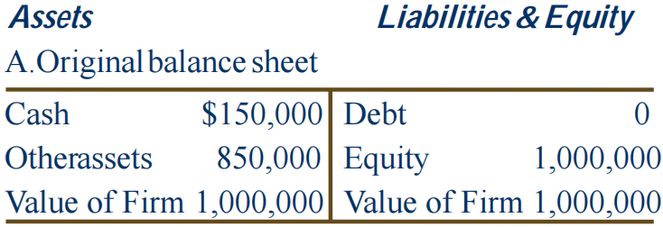
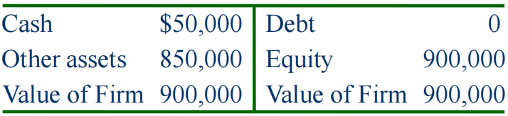

# 现金管理

## 第十九章 Dividends and Other Payouts

分红与其他回报方式

本章主要介绍regular cash dividend现金分红、stock dividend股票分红、dividend in kind实物分红和repurchase of stock股票回购，并比较了现金分红和股票回购两种模式的异同。注意，现金分红和股票回购都使得公司的现金流向股东，但股票分红和拆股、并股没有现金流动。

### Different Types of Dividends 股利支付的类型 

regular cash dividend 现金分红或正常现金股利：

* 大多数公司通常按季发放（quarterly）；
* 有时公司可能会发放额外现金股利（即股份公司除了按股份向股东分配股利外，在经营状况较佳、盈利较大时额外给股东增加的股利）；
* 最极端的情况是发放清算股利（liquidating dividend，即 A 公司投资了 B 公司，B 公司给 A 公司的分红超出 A 公司因 B 公司盈利产生的净利润的部分需要 A 公司分红处理）。

stock dividends 股票利息：公司没有现金流出，但是增加了流通股数量。

dividend in kind 实物股利：公司采用赠送商品或商品打折的方式进行分红。

### Standard Method of Cash Dividend Payment 现金分红的标准流程（美国）

Declaration Date 股利宣布日：宣布支付股利，股利成为公司的义务。

Ex-dividend Date 除息日：

* 在股权登记日前两个工作日发生；
* 如果在此日期或之后购买股票将不会收到即将到来的股息；
* 股票价格通常会因分红下降（但分红如果象征着好的信号，可能当日股价的上涨会超过因分红下降的数额）。

Date of Record 股权登记日：登记最终获得分红的人。

Date of Payment 股利支付日：邮寄支票（通俗理解给钱那天）。

### Does Dividend Policy Matter 股利政策重要吗

不重要

* 分红不影响投资者收益和股票价值；
* 现在收益vs未来收益：分红本质上是舍弃公司未来的收益，这部分钱可以reinvest（再次用于投资），从而在未来提供更高的分红；
* MM理论表明股利政策不影响投资者收益，投资者可以通过卖出股票获得现金，本质上是一种股利（homemade dividends）；
* 这些理论基于一些不现实的场景，例如没有税和经纪费（破产成本）等。

重要

* Bird-in-the-hand Theory：股息比未来预期收益风险小；
* Agency problem 代理人问题：将公司持有的现金分红可以避免经理浪费现金；
* 税收政策：派息后股东需要交税，低派息则交税少；
* 信息内容：派息增多可能是和公司经营状况变好有关。

### Clientele Effect 客户效应

公司的股利政策倾向于吸引不同的投资者群体，因为不同的投资人有不同的分红策略喜好。具体来说，那些希望当前投资收入较高，并期望放弃预期的长期资本利得的投资者，将购买拥有高股息派息记录的公司的股票。相反，那些处于最佳收入和储蓄年的投资者可能会选择拥有有低（或零）股息支付记录的公司的股票。

公司过去的股息政策决定了其当前的投资者客户，客户效应阻碍了股息政策的改变，因为更换股息政策会导致原先的人出售股票和新的一批人购买，这其中的税收和经纪成本伤害了那些由于支付政策的改变而不得不更换公司的投资者，因此这一理论建议公司不要随便更改股息政策。

### Repurchase of Stock 股票回购

* 公司可以通过购买自己的股票来消耗多的现金，不一定需要现金分红。实际上股票回购和现金分红的本质都是现金从公司流向股东；
* 目前股票回购越来越重要，大致原因有对于投资人而言更有选择，因为分红一定会发生而回购允许投资者决定是否将股票兑换成现金，对于公司也更自由，因为股票回购并不像分红那样被视为公司盈利能力的表现，当然回购也有表明当前股价被低估的信息；
* 分红有相应的税收政策（按照时间划分），而股票回购只有回购价格高于投资人购买价格的收益才会征税。

三种方式：

* Open market：公司直接在公开市场上购买；

* Tender offer：投标报价，声明希望购买的价格和股数；

* Targeted repurchase：从特定股东手上购买股份。

与现金分红比较：

假设公司初始财务报表如图 1 所示，假设公司股价为 \$10（即公司总股票数为100,000股），现在公司希望分发 $100,000 给投资人，分别采取现金分红和股票回购，得到的财务报表结果均如图 2 所示。

图1

图2

然而，在选择现金分红时，股价会下降为 \$900,000 / 100,000 = $9，而在回购股票时，股价为 \$900,000 / 90,000 = \$10，我们发现在没有债务的情况下回购股票时股价是不变的，这与现金分红不同。

### Stock Dividend 股票分红

* 即以分发股票代替分发现金，按持股量派发新股份，例如你持有 100 股某公司股票，公司准备进行 10% 的股票分红，你将会得到 10 股新股；
* 增加了股票数量，但公司总资产不变，因此股票价格下降，例如某公司有 2 million 股票，每股市场价 \$15，现在公司进行 50% 的股票分红，则股票总数变为 2 * (1 + 50%) = 3 million，股价下降为 2 * \$15 / 3 = \$10；
* 目的是让价格回降到合理区间；
* Small/Large stock dividend 以 20%-25% 为界限划分。

### Stock Splits 拆股

* 本质上与股票分红一致，都是增加股数，但公司总资产不变，因此价格下降，但是表示方法有区别，我们一般写作 M-for-N 的拆股，意思是原来的 N 股变为了现在的 M 股。当然 M > N 时为拆股，相反时为并股（reverse stock splits），但一定注意并股不等同于股票回购，虽然结果都是股票数量减少，但并股不改变公司总资产，而股票回购是消耗了公司的现金；
* 目的同样是让价格回降到合理区间。