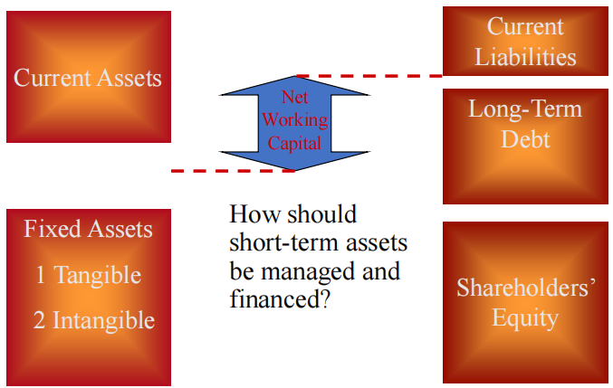

# 简介

## 课程说明（2022-2023秋冬）

### 分数构成

* 作业+到课（20%）：共两次作业，每个章节4题左右，今年因疫情洪鑫老师取消了第二次作业。到课方面本人选择线上班没有这方面顾虑，当然洪鑫老师本来也不点名。
* 文献综述（30%）个人作业，中英文均可，往年要求10页以内，今年疫情原因洪鑫老师减少到5页以内。

* 期末考试（50%）开卷考试，允许带计算器（且很有必要带）。往年有选择+计算+简答等题型，今年因疫情线上考试改为35个选择题，前30题每个3分，最后5题每题2分。

### 课程内容

* 教材：公司理财（第11版）[美] 斯蒂芬 A. 罗斯等 著
* 讲义：洪鑫老师的 PPT。注意作业考试都是英文，PPT 上也大都是英文
* 内容：第1-11章，13章，15-20章（第20章因课时原因2022-2023秋冬未讲授）

两次作业答案（含题目）分享在下方：

<a href="https://github.com/yhwu-is/Notes/raw/main/docs/finance/corporate/assets/HW%231%20Key%202022%20Fall.pdf" download="文件名.txt">第一次作业</a>

<a href="https://github.com/yhwu-is/Notes/raw/main/docs/finance/corporate/assets/HW%232%20Key%202022%20Fall.pdf">第二次作业</a>

## 第一章 Introduction to Corporate Finance 

公司金融简介

### Corporate  Finance 公司金融

公司金融主要研究以下问题：

* Captical Budgeing 投资决策 资本预算

* Capital Structure 融资决策 资本结构

* Woring Captical Management 短期财务管理 股利支付政策

### Balance Sheet Model of the Firm 资产负债表 

该图具体内容在下一章展开，此处告诉我们，净运营资本 = 短期资产 - 短期负债。

### Forms of Business Organization 运营组织形式

**The Sole Proprietorship** 个人独资企业：个人所有，个人财产对企业债务承担无限责任。

**The Partnership** 合伙企业

* General Partnership 普通合伙企业：由普通合伙人组成，合伙人队合伙企业债务承担无限连带责任。
* Limited Partnership 有限合伙企业：由普通合伙人和有限合伙人组成，普通合伙人对合伙企业债务承担无限连带责任，有限合伙人以其认缴的出资额为限对合伙企业债务承担责任，但有限合伙人不得干预管理。

**The Corporation** 公司：公司是企业法人，有独立的法人财产，公司以其全部财产对公司的债务承担责任（即公司财产与股东财产分离）。特殊的有一人有限责任公司，指只有一个自然人股东或者一个法人股东的有限责任公司，这类公司股东不能证明公司财产独立与股东自己财产的，应当对公司债务承担连带责任。

### The Goal of Financial Management 公司财务管理的目标

一言以蔽之，财务管理的终极目标是即最大化股东权益（Maximize shareholder wealth），其他如利润最大化、最小化成本、最大化市场份额（market share）都有其片面性或弊端。

### The Agency Problem 代理人问题

* 代理关系：委托人聘请代理人代表他/她的利益，在公司金融中为股东（委托人）聘请经理（代理）来管理公司；
* 代理人问题：委托人和代理人之间的利益冲突，即公司持有者（股东）与经理的利益冲突。

