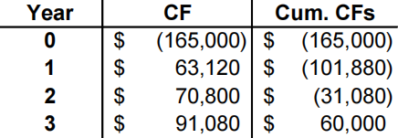
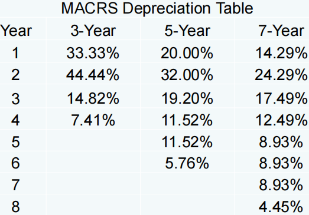
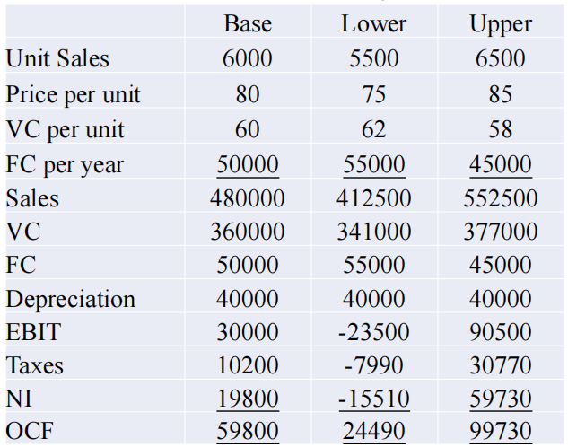

# 现金流

## 第四章 Discounted Cash Flow Valuation

折现现金流估计

本章介绍关于现金流贴现的几个基本概念和基本模型。

### Compound interest 复利

我们首先说明几个名词：

* **Future Value 终值**：简记为 $FV$，指现金流到末期的价值（不贴现到现在）。

* **Present Value 现值：**简记为 $PV$，指现金流贴现到现在的价值。

* **Net Present Value 净现值：**简记为 $NPV$，指投资期望收益贴现为现值后减去初始投资后得到的结果。

多期投资的终值公式：

$$FV=C_0 \times (1+r)^T$$

其中 $C_0$ 为初始的现金流，$r$ 表示利率，$T$ 为投资的期数。

### Multiple Cash Flows 多重现金流

我们只需要计算出每期现金的贴现值然后求和即可，这是之后公式推导的基础。

### Compounding Periods 复利周期

有时候银行支付利息并不是按年支付的，比如按半年、季度、月支付。假设在 $T$ 年内每年回报 $m$ 次，则现金流终值为

$$FV=C_0 \times (1+\cfrac{r}{m})^{m \times T}$$

此处涉及两个利率概念：

**Annual Percentage Rate(APR) 名义年利率：**不考虑复利的年利率，即每期利率乘以一年的期数（上式中的 $r$）。

**Effective Annual Rate(EAR) 实际年利率：**考虑复利，满足 $FV=C_0\times (1+EAR)^T$。

### Simplifications 简化模型

下列各式中，$C$ 表示每期现金流，$r$ 表示贴现率， $g$ 表示年金增长率，$T$ 表示到期期数。

* **Perpetuity 永续年金：**每期（且 regular interval 间隔固定，下同）现金流恒定且永远持续。

$$PV=\cfrac{C}{r}$$

* **Growing perpetuity 增长型永续年金：**现金流定速增长且永远持续。

$$PV=\cfrac{C}{r-g}$$

* **Annuity 年金：**每期现金流恒定且有固定到期时间。

$$PV=\cfrac{C}{r}\left[1-\cfrac{1}{(1+r)^T}\right]$$

* **Growing annuity 增长型年金：**现金流定速增长且有固定到期时间。

$$PV=\cfrac{C}{r-g}\left[1-(\cfrac{1+g}{1+r})^T\right]$$

解决此类问题一定要注意回报是从当期开始还是下一期开始，因此还是记住基于 Multiple Cash Flows 多重现金流的推导过程更加稳妥。

## 第五章 Net Present Value and Other Investment Rules

净现值和投资评价的其他方法

本章介绍投资评价的几种基本方法。

### The Net Present Value (NPV) Rule 净现值法

* 基本思路：NPV = 未来收益现金流的现值 - 初始投资。这一公式需要①估计未来现金流的量以及出现的时间；②估计贴现率；③估计初始投资。
* 最低接受标准：如果NPV > 0，则接受。
* 排名标准：优先选择具有最高净现值的项目。

$$\textup{NPV}=\sum\limits_{t=0}^n\cfrac{CF_t}{(1+R)^t}=\sum\limits_{t=1}^n\cfrac{CF_t}{(1+R)^t}-CF_0$$

注意：NPV 法是最常用的方法之一，也是首选的决策准则。

### The Payback Period Method 回收期法

* 基本思路：计算这个项目需要多长时间能收回初始投资，即回收期 = 收回初始成本的年数。
* 最低接受标准：按管理层设定。
* 排名标准：按管理层设定。

注意这里没有像 NPV 法那样的绝对标准，因为管理层对于不同项目多长时间收回成本有各自的判断，这是其中一个缺点。另一个缺点是这一方法计算时没有计算贴现，因此忽略了时间价值。

我们给出一个例子：

上图中的括号代表现金流支出，最右边一栏是当期累计现金流。于是我们发现在 2-3 年间收回了初始成本。这一方法假定收回成本随时间均匀分布，因此结果为 2 + 31,080 / 91,080 = 2.34 years。

### The Discounted Payback Period Method 折现回收期法

* 基本思路：考虑到现金时间价值的情况下项目需要多长时间才能收回初始投资。
* 决策规则：如果项目在规定的时间内按折扣价还款，则接受该项目。
* 实际上在我们使用这种方法贴现现金流时，可以同时计算出净现值。

### The Internal Rate of Return (IRR) 内部收益率法

* 内部收益率：使得净现值为零的贴现率。
* 最低接受标准：如果内部收益率超出投资人要求的回报率（贴现率），若二者相等则接受与不接受等概率。
* 排名标准：选择内部收益率最高的。

**Reinvestment Assumption 再投资假设**

* 所有未来现金流都能以内部收益率再投资。例如某个项目 IRR = 20%，公司融资成本 = 10%，那么再投资假设认为将项目赚到的钱花在市场别的投资上，仍能赚到 20% 的回报率；
* 但这一假设在现实生活中很难实现，所以再投资假设是 IRR 自身的一个缺陷，可能会高估项目自身的回报率，给投资者带来错误的信息；
* NPV 解决了再投资假设的缺陷，认为赚到的钱再投资的回报率是公司的融资成本，这个假设更为实际。

**Mutually Exclusive Projects vs. Independent Projects 互斥项目与独立项目**

* 互斥项目指多个项目只能做一个，例如我需要一个考试系统，我需要从多个关于考试系统的项目中选一个做，即我们要对所有的选择排序，并选择最好的一个；
* 独立项目接受或拒绝其中一个项目并不影响其他项目的决定，接受条件是必须超过最低标准；
* IRR 是一个相对数，NPV 是一个绝对数，因此有时会有矛盾的情况出现。比如项目 A 的 NPV 大于项目 B，但是 IRR 却是项目 A  小于项目 B（例如 A 的项目规模比 B 大）。此时很难做出一个决定，因为两种方式一个是绝对值，一个是相对值。一般情况下会优先 NPV 的结果。

**IRR & Non-Conventional Cash Flows IRR 与非常规现金流**

* 非常规现金流：现金流符号改变了大于 1 次。通常是关闭项目时出现现金流出，典型的例子是核电站；
* IRR 在传统现金流下只有一个值（即项目开始现金流出，之后均为现金流入）；但是如果后续现金有流入也有流出，IRR 的值可能超过 1 个，此时 IRR 就不具有参考性了，应当考虑 NPV。

### The Profitability Index (PI) 盈利指数法

* 基本思路：计算未来收益现金流的现值 $\div$ 初始投资；
* 最低接受标准：如果 PI > 1，则接受；
* 排名标准：选择 PI 最高的备选方案。

## 第六章 Making Capital Investment Decisions

投资决策

### Relevant Cash Flows 相关现金流量

* 只有在项目被接受时才会发生的现金流；
* Incremental cash flows 增量现金流量（核心）：接受项目直接导致的公司现金流的变化，计算公式为 Corporate cash flow with the project - Corporate cash flow without the project，即公司有无该项目的现金流差值；
* Stand-alone 原则使我们能通过关注增量现金流来独立于公司地分析每个项目。

注意以下要素是否应该在投资决策中考虑：

* “Sunk” Costs 沉没成本（不考虑）：已发生且不能消除的成本，因此不应在投资决策中予以考虑；
* Opportunity Costs 机会成本（考虑）：如果进行了特定的投资，就放弃最有价值的选择；
* Side Effects 副效应（考虑）：① Positive side effects (Synergy) 协同效应：对其他项目的好处（一个新产品增加了销售，从而增加了现有产品的现金流）；② Negative side effects (Erosion) 侵蚀效应：增加其他项目的成本（一个新项目减少了现有项目的现金流）；
* Net Working Capital 净营运资本（考虑）：公司一开始提供营运资金，最后收回，具体而言需要在生产和销售前购买原材料，产生库存投资，以及用现金来缓冲不可预见的支出；在项目的最后一年，净营运资金将降至零；对营运资金的投资将在项目使用寿命结束前完全收回。
*  Financing Costs 融资成本（不考虑）：在计算现金流时，我们通常不包括与利息支付或债务本金、股息或其他融资成本相关的现金流。融资成本反映在用于贴现项目现金流的贴现率中；
* Tax Effects 税收效应（考虑）：属于现金流，故考虑。

### Pro Forma Statements and Cash Flow 预测报表与现金流

* Pro Forma Financial Statements 预测财务报表：提出（project）未来的行动；
* Operating Cash Flow 经营现金流量：

$$\rm OCF = EBIT + Depr – Taxes$$

$$\rm OCF = NI + Depr(无利息支出的情况)$$

$$\rm OCF = (Sales – Costs)\times(1 – T) + Depreciation \times T(无利息支出的情况，重要！)$$

* Cash Flow From Assets 资产现金流量：

$$\rm CFFA = OCF – NCS –ΔNWC$$

$$\rm NCS = Net capital spending$$

### Depreciation & Capital Budgeting 折旧与资本预算

由于折旧有税盾，因此通过税额影响公司现金流，因此我们需要在投资决策中考虑这一概念。

* 使用美国国税局（IRS）要求的折旧时间表，有控制税收的目的；
* Depreciation = non-cash expense 折旧 = 非现金支出，仅与税收影响（现金流）相关；
* Depreciation tax shield 税盾=D $\times$ T，其中 D = 折旧损失，T = 边际税率。

计算折旧有两种方法：

* Straight-line depreciation 直线折旧法：D = (Initial cost – salvage) / number of years，直线折旧到残值（Salvage Value）；
* MACRS (Modified accelerated cost recovery system) 加速折旧法：根据折旧表折旧到 0，每期折旧等于折旧百分比乘以资产初始投资，折旧表如下：

### After-Tax Salvage 税后残值

* 如果残值与资产的账面价值不同，则存在税收效应；
* Book value = initial cost – accumulated depreciation 账面价值 = 初始投资 - 累计折旧；
* After-tax salvage = salvage – T(salvage – book value) 税后残值 = 残值 - 税率 $\times$（残值 - 账面价值）；
* 税收对残值的影响：Net Salvage Cash Flow = Selling Price - (Selling Price -Book Value) * Corporate tax rate 净残值现金流 = 出售价格 - （出售价格 - 账面价值）* 公司税率。

## 第七章 Risk Analysis, Real Options, and Capital Budgeting

风险分析、实物期权和资本预算

NPV 的计算是对项目未来收益的一个初步估计，但是仍需要对预期风险进行估计。本章介绍四种风险分析方式，并且介绍实物期权表明公司可以动态调整自己的投资策略。

### Sensitivity Analysis 敏感分析

– What happens if certain variables are forecasted incorrectly? 如果对某些变量预测不正确会发生什么？

* 当我们一次改变一个变量时，NPV 会有什么影响；
* 场景分析的一个子集，我们关注特定变量对净现值的影响（场景分析关注很多变量同时变化导致的场景变化的影响）
* NPV 对某变量越敏感（或 volatility 波动性大），则该变量的预测风险越大，因此我们应当更关注这一变量的估计。

### Scenario Analysis 场景分析

 – What happens if a logical set of variables are forecasted incorrectly? 如果对一组逻辑变量预测不正确会发生什么？

* 在不同的现金流情景下的净现值会有什么影响；
* 至少需要关注①最好的情况——高收入，低成本；②最坏的情况——低收入，高成本；然后衡量可能的结果的范围；
* 最好的情况和最坏的情况不一定合理，但它们仍然是可能的。

上图是一个场景分析的例子，我们改变了多个参量，包括销售额和 FC （即固定成本），研究不同情况下的 OCF，如果是敏感分析，这两个变量我们应当一次只改变一个进行分析。

### Simulation Analysis 蒙特卡罗模拟

– Alternative results when a large number of different scenarios are proposed. 大量不同场景下得到大量可选择的结果。

模拟分析实际上只是一个拓展的敏感分析和场景分析，蒙特卡罗模拟可以基于条件概率分布和每个变量的约束来估计数千个可能的结果，实际上相当于可以一次性完成数千次的敏感/场景分析。

### Break Even Analysis 盈亏平衡

– What is the minimum level of sales (prices, costs) which still allows the project a non-negative NPV? 使得 NPV 非负的底线销量是多少？

* 分析销售量（sales volume）和收益率（profitability）之间关系的常用工具；
* 有三个常见的盈亏平衡指标：①会计收支平衡：NI = 0 时的销售额（时间成本无法收回）；②现金流盈亏平衡：OCF = 0 时的销售额（时间成本和初始投资都无法收回）；③财务盈亏平衡：NPV = 0 时的销售额（真正的不盈不亏）。

### Real Options 实物期权

期权一词可能比较抽象，这是一种选择权，指一种能在未来某特定时间以特定价格买入或卖出一定数量的某种特定商品的权利。在此处就是公司可以动态调整自己的投资规模或策略。

* The Option to Expand 拓展期权：Has value if demand turns out to be higher than expected. 项目比预期好时可以拓展项目；
*  The Option to Abandon 放弃期权：Has value if demand turns out to be lower than expected. 项目比预期差时可以放弃项目；
*  The Option to Delay 择机期权：Has value if the underlying variables are changing with a favorable trend. 如果项目的影响因素向好的方向发展，可以等最赚钱的时候投入项目。

## 第八章 Interest Rates and Bond Valuation

利率与债券估值

###  Bonds 债券

债券是在借款人和贷款人之间签订的具有法律约束力的协议（legally binding agreement），我们需要介绍几个关于债券的基本名词：

* **Par (face) value 面值：**到期归还给债券持有人的本金（principal）；
* **Coupon rate 息票利率：**债券发行人在证券期限内支付的利率。“coupon”一词来源于使用actual coupon定期收取利息的历史用途。一旦在发行日期确定，该债券的息票利率将保持不变，而该债券的持有者将按预定的时间频率（每半年或一年等）获得固定的利息支付；
* **Coupon payment 利息**：等于面值乘以息票利率，即每期返还的利息；
* **Maturity Date 到期日：**归还本金和所有剩余利息的日期；
* **The yield to maturity (YTM) 到期收益率：**债券持有人要求的回报率，也即投资者持有该债券到期的内部收益率（IRR）。注意 YTM = coupon rate 时债券价值等于面值，YTM > coupon rate 时债券价值小于面值（折价债券），YTM < coupon rate 时债券价值大于面值（溢价债券）。

需要强调的是债券的基本流程，每过一期（半年或一年等）按息票利率返还一定利息，然后在到期日归还本金（面值）和所有剩余利息。

### Bond Valuation 债券估值

基本原则：金融资产价值 =  预期的未来现金流的现值。因此债券价值是由息票支付和票面价值的现值决定的，故利率与现值成反比（inversely related）。我们的公式如下：

$$\textup{Bond Value}=C\left[\cfrac{1-\cfrac{1}{(1+r)^T}}{r}\right]+\cfrac{F}{(1+r)^T}$$

### Interest Rate Risk 利率风险

**Price Risk 价格风险**

* 利率变化会引起债券价值的变化，利率与债券价值变动方向相反；
* 长期债券比短期债券的价格风险更大；
* 低息票利率债券比高息票利率债券的价格风险更大。

**Reinvestment Rate Risk 再投资风险**

* 不复利的情况下我们可以每年取走利息再投资，再投资的回报率低于息票利率的风险称为再投资风险；
* 高息票利率债券比低息票利率债券有更大的再投资利率风险。因为更难找到比高息票利率债券回报高的新投资项目；
* 短期债券比长期债券有更大的再投资风险，因为短期债券结束后受到利率影响可能投资项目回报都很低，不如选择长期债券获得更高的稳定回报。

### After-tax Yields 税后收益

政府发行债券不需要缴税引发的选择问题。

我们举一个例子，假设一个应税债券的收益率为 8%，市政债券（无需纳税）的收益率为 6%：

* 如果税率为 40%，8% * (1 - 0.4) = 4.8%，即公司债券的税后回报率为4.8%，而市政债券的回报率为6%；
* 多高的税率使得你不关心两种债券的选择？8% * (1 – T) = 6%  $\to$ T = 25%。

### Bond Ratings – Investment Quality 债券评级-投资质量

**High Grade**

* Moody’s Aaa and S&P AAA – capacity to pay is extremely strong 支付能力极强
* Moody’s Aa and S&P AA – capacity to pay is very strong 支付能力很强

**Medium Grade**

* Moody’s A and S&P A – capacity to pay is strong, but more susceptible to changes in circumstances 支付能力强，但易受环境变化影响）
* Moody’s Baa and S&P BBB – capacity to pay is adequate, adverse conditions will have more impact on the firm’s ability to pay 支付能力适中，不利条件对支付能力影响更大

**Low Grade**

* Moody’s Ba and B / S&P BB and B
* Considered speculative with respect to capacity to pay 支付能力有风险

**Very Low Grade**

* Moody’s C / S&P C & D
* Highly uncertain repayment and, in many cases, already in default, with principal and interest in arrears 还款有高度不确定性，在许多情况下已经违约，即拖欠本金和利息

### Inflation and Interest Rates 通货膨胀与利率

* Real rate of interest 实际利率——change in purchasing power 物价水平不变（货币购买力不变）条件下的利率（但实际有通货膨胀，故物价水平会改变，所以我们通过减去通货膨胀率使得物价水平回到原来的状态，然后再计算利率即为真实的回报率，因此实际利率是剔除了通货膨胀率后储户或投资者得到利息回报的真实利率）；

* Nominal rate of interest 名义利率——quoted rate of interest, change in purchasing power and inflation 报价利率，不考虑通货膨胀因素。

公式（Fisher Effect，费雪效应）：$(1+R)=(1+r)(1+h)$，或 $R=(1+r)(1+h)-1$。其中 $R$ 表示名义利率，$r$ 表示实际利率，$h$ 表示预期通货膨胀率。这一公式的近似形式为 $R = r + h$。当实际利率和预期通货膨胀相对较高时，实际的费雪效应和近似之间存在较为显著的差异。

## 第九章 Stock Valuation

股票估值

### Stock Value 股票价值

与债券估值一章中介绍的一致，基本原则为金融资产价值 =  预期的未来现金流的现值，故公式为

$$P_0=\sum\limits_{t=1}^\infty \cfrac{D_t}{(1+R)^t}$$

这一模型称为股利贴现模型，但 $D_t$ 是难以预测的，因此这一模型价值有限，并且导致上式很难计算，我们只能考虑以下几种特殊情况：

**Zero Growth 零增长**

类似于优先股，公司会永续提供定额分红，公式如下：

$$P_0=\cfrac{\textup{Div}}{R}$$

**Constant dividend growth 固定增长**

公司每一期提供固定增长率的分红，公式如下：

$$P_0=\cfrac{\textup{Div}_1}{R-g}=\cfrac{\textup{Div}_0(1+g)}{R-g}$$

此处 $g$ 表示增长率，若 $R < g$ 则分红增速大于贴现率，导致分红现值也是递增的，求和结果为无穷。

**Nonconstant growth 变动增长**

假设股息在可预见的未来会以不同的速度增长，然后又会以恒定的速度增长。计算此类股票的价值我们需要：

1. 估计可预见的未来中估计不定速增长阶段的股息；
2. 估计未来股票成为持续增长股票时的股票价格；
3. 以适当的贴现率计算估计的未来股息和未来股票价格的总现值。

假设股息以 $g_1$ 增长 $N$ 年，此后以 $g_2$ 永续增长，公式如下：

$$P=\cfrac{C}{R-g_1}\left[1-\cfrac{(1+g_1)^T}{(1+R)^T}\right]+\cfrac{\left(\cfrac{\textup{Div}_{T+1}}{R-g_2} \right)}{(1+R)^T}$$

实际上就是结合了增长型年金和固定增长型股票的计算公式。

### Estimates of Parameters 参数估计

根据我们之前讨论的公式我们知道，一家公司的价值取决于其增长率 $g$ 和贴现率 $R$。因此增长率的估计（Estimating the Dividend Growth Rate）是一个重要的话题，我们有两种方式：

1. 基于历史数据求平均。原则是历史数据波动不大且今年的情况与往年类似。
2. 我们知道下一年的收益 = 今年的收益 + 今年的留存收益（retained earnings）$\times$ 留存收益的回报率（return on retained earnings），加号后的部分我们可以视为新增的股东权益。现在我们将等式两边同时除以今年的收益，我们可以得到

$$1+g=1+\textup{Retaintion ratio} \times \textup{Return on retained earnings}$$

### Growth Opportunities 成长机会

成长机会是投资于正的净现值项目的机会。一个公司的价值可以被概念化（conceptualized）为一个公司将其 100% 的收益分红的价值加上成长机会的净现值的总和：

$$P=\cfrac{EPS}{R}+NPVGO$$

其中 $EPS$ 为每股收益，$R$ 为贴现率，$NPVGO$ 为成长机会的净现值。

我们知道 $PE$（市盈率）也是反映成长机会的参数。我们将上式每一项都除以 $EPS$，可以得到以下关于 $PE$ 的描述：

$PE=\cfrac{1}{R}+\cfrac{NPVGO}{EPS}$

由此我们知道，一个公司的市盈率与成长机会呈正相关，与贴现率（也可以称为风险，因为贴现率也可以称为投资人要求的回报率，而在资本资产定价模型中我们了解到，投资人要求回报率与风险呈正相关）呈负相关。