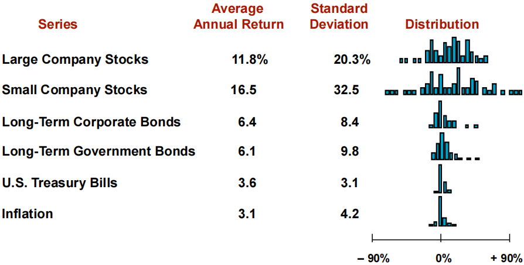

# 风险与收益

## 第十章 **Risk and Return: Lessons from Market History** 

风险与收益：历史的启示

### Stock Return 股票收益

收益分为两部分：分红带来的收益与股票市场价格变化带来的收益，写作公式

Return = Dividend + Change in Market value

收益百分比即收益除以股票**初始**的市场价格，将收益按照上面的公式拆分有

$\begin{align}\textup{Percentage Return} &= \cfrac{\textup{dividend + change in Market value}}{\textup{beginning market value}}\\ &= \textup{dividend yield} + \textup{capital gains yield}\end{align}$

### Return Statistics 收益统计

平均收益：$\overline{R}=\cfrac{R_1+\cdots+R_T}{T}$

收益标准差（VAR 为方差）：$SD=\sqrt{VAR}=\sqrt{\cfrac{(R_1-\overline{R})^2+\cdots+(R_T-\overline{R})^2}{T-1}}$

上述式中的 $T$ 为收到回报的期数。

### Historical Returns(1926-2011) 历史收益

### Risk Premiums 风险溢价