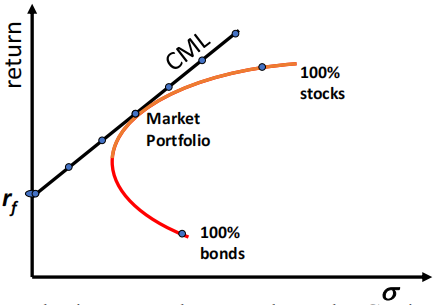
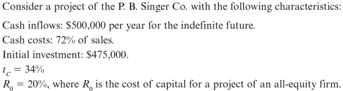

# 风险与收益

## 第十章 Risk and Return: Lessons from Market History

风险与收益：历史的启示

本章从历史角度实证研究“风险越大，收益越高”的说法是否正确，在后续章节中则继续研究这一说法的理论支持。

### Stock Return 股票收益

收益分为两部分：分红带来的收益与股票市场价格变化带来的收益，写作公式

Return = Dividend + Change in Market value

收益百分比即收益除以股票**初始**的市场价格，将收益按照上面的公式拆分有

$\begin{align}\textup{Percentage Return} &= \cfrac{\textup{dividend + change in Market value}}{\textup{beginning market value}}\\ &= \textup{dividend yield} + \textup{capital gains yield}\end{align}$

### Return Statistics 收益统计

平均收益：$\overline{R}=\cfrac{R_1+\cdots+R_T}{T}$

收益标准差（VAR 为方差）：$SD=\sqrt{VAR}=\sqrt{\cfrac{(R_1-\overline{R})^2+\cdots+(R_T-\overline{R})^2}{T-1}}$

上述式中的 $T$ 为收到回报的期数。

### Historical Returns(1926-2011) 历史收益

我们可以从上图的分布中看出，股票的风险大于债券（方差更大），且小公司的风险更大，但从平均收益来看股票风险大相应的收益也大，并且小公司平均收益更大。

### Risk Premiums 风险溢价

收益率可以分为两部分，一部分称为Risk-free rate（无风险收益率），另一部分称为Risk premium（风险溢价）。

无风险收益率：Rate of return on a riskless investment（无风险投资的回报率），Treasury Bills are considered risk-free（短期国债可以视为无风险的）。

风险溢价：Excess return on a risky asset over the risk-free rate（有风险投资收益率中高出无风险收益率的部分），可以视为Reward for bearing risk（对于忍受风险的补偿）。

## 第十一章 Return and Risk: The Capital Asset Pricing Model (CAPM)

收益与风险：资本资产定价模型

本章将从理论模型的角度说明风险与回报的关系。本章介绍了两个模型，第一个是CML，即资本市场线，针对投资组合给出了风险与收益的关系，第二个是资本资产定价模型，研究了系统性风险与风险溢价，给出了单个资产风险与收益的关系（即SML，证券市场线），并在这两个模型推导过程中介绍了大量的相关概念。

### Individual Securities 对于独立的单个资产而言

**Expeted Return 期望收益**

期望收益等于不同状况下（如衰退，正常，扩张等）收入的数学期望（概率加权平均），记作公式

$$E(R)=\sum_\limits{i=1}^np_iR_i$$

**Varience 方差**

方差与之前描述的不同，现在是不同状况下收益偏离期望收益的平方的数学期望，记作公式

$$\sigma^2=\sum\limits_{i=1}^np_i(R_i-E(R))^2$$

与之前一样，方差越大，回报与平均回报可能的的价差就越大。

### The Return and Risk for Portfolios 投资组合的回报和风险

对于投资组合，我们来看以下例子。注意，股票的预期回报高于债券，风险也更高。现在让我们来看看50%投资债券，50%投资股票的投资组合的风险回报权衡：

接下来计算这一投资组合的期望收益和方差：

我们可以看到：

1. 期望收益就是投资组合中不同资产预期回报率的加权平均值（9% = 11% * 0.5 + 7% * 0.5）；
2. 投资组合的方差不是单个资产方差的加权平均值，我们发现此例中其方差小于原先任一单个资产的方差（此时不能用 0.0205 * 0.5 + 0.0067 * 0.5 计算，只能按照方差定义对投资组合三种情况下的收益 5.0%、9.5%、12.5% 求方差）。

### Computing a Portfolio’s Variance and Volatility 计算一个投资组合的方差和波动性

我们考虑购买两种资产的情况，我们有（式中 $R$ 表示 return，$p$ 即 portfolio，投资组合）

$\begin{align}Var(R_P) &= Cov(R_P,R_P) \\ &= Cov(x_1R_1+x_2R_2,x_1R_1+x_2R_2) \\ &= x_1^2Cov(R_1,R_1)+2x_1x_2Cov(R_1,R_2)+x_2^2Cov(R_2,R_2)\end{align}$

即 $Var(R_P)=x_1^2Var(R_1)+x_2^2Var(R_2)+2x_1x_2Cov(R_1,R_2)$，故显然不是单个资产的加权平均，还要考虑协方差等因素。

其中 $Cov$ 表示协方差，计算公式为

$$Cov(R_i,R_j)=E[(R_i-E[R_i])(R_j-E[R_j])]$$

或

$$Cov(R_i,R_j)=\cfrac{1}{T-1}\sum_t(R_{i,t}-\overline{R_i})(R_{j,t}-\overline{R_j})$$

若协方差为正，表明二者趋向于同方向变化，否则二者趋向于反方向变化。

基于此我们还可以定义相关系数 $Corr(R_i,R_j)=\cfrac{Cov(R_i,R_j)}{SD(R_i)SD(R_j)}$，其中 $SD$ 为标准差。相关系数总是在 -1 和 +1 之间的，0 表示二者无关，绝对值越接近 1 表明相关性越大，正值表示正相关，负值表示反相关（注意相关系数的正负就是协方差的正负，因为标准差不会小于 0）。

### The Efficient Set for Two Assets 两种资产的有效集

实际上对于两种资产组成的资产组合，我们可以考虑两种资产以不同的比例进行投资，于是我们可以得到上图中不同的点，这些点的含义是不同比例混合后的资产组合在不同收益（纵坐标）下的风险（横坐标）。这些点也可以称为  Opportunity set  机会集 或 feasible set  可行集，表示由给定资产构建的所有投资组合可能的预期回报和标准差对。

但我们发现一些投资组合比其他投资组合好，即它们在相同或更低的风险水平上有更高的回报。例如图中圈内的点，比下方的点在相同风险下有更高的回报。我们称这一部分点集为 Efficient Set 有效集 或 Efficient frontier 有效边界，表示一组最优投资组合，即为确定的风险水平提供最高的预期回报，或为给定的预期回报水平提供最低的风险。

### Short Sales 卖空

* Long Position 多头：投资者对股市看好，于是趁低价时买进股票，待股票上涨至某一价位时再卖出，以获取差额收益；

* Short Position 空头（对应 short sales）：投资者认为某种商品、股票、债券等的价格将要下跌，于是借股（即融券）卖出，希望在跌价后再买回或补进，获取差额利益。投资者在卖出后至未买回或补进前，手中并无实物，故称“空头”。允许卖空的投资组合可行集可以无限延伸。

### The Risk–Return Combinations from Combining a Risk-Free Investment and a Risky Portfolio 无风险投资和风险投资组合的风险回报组合

我们可以考虑使用无风险的投资（例如短期国债）来进一步降低风险，当然这也可能降低期望收益，如下图所示：

图中左下方表示风险为 0 的无风险资产，这一资产将与曲线确定的可行集对应的投资组合进一步组合成为新的投资组合，如图中直线所示（直线原因在于无风险的方差为 0，且与其他资产协方差也为 0，根据投资组合方差公式可以得到在横坐标为方差的情况下组合可行集为直线），其中 $x$ 表示投资风险投资组合的比例。其中后面超出 100% 的部分可以视为卖空（融券）了无风险资产。

于是我们很容易看到，下图所示的与风险资产组合有效集的切线是所有可能直线中同一风险对应回报最高的，这构成了考虑无风险资产投资时新的有效资产组合（Efficient Portfolio）。

这一直线对应于以下假设：

* 假设1：投资者可以以具有竞争力的市场价格购买所有证券（不产生（incur）税收或交易成本）买卖所有证券，也可以以无风险的利率借贷；
* 假设2：投资者只持有有效的交易证券投资组合——在给定的波动水平下产生最大预期回报的投资组合；
* 假设3：投资者对证券的波动性、相关性和预期回报都有共同期望（ homogeneous expectations），共同期望假设认为世界上所有的投资者对期望收益、方差和协方差的估计完全相同。

### Security Demand Must Equal Supply 证券需求必须等于供给

* 基于共同期望假设，所有投资者都将要求相同的有效风险证券投资组合；
* 所有投资者的风险证券的组合投资组合必须等于有效的投资组合；
* 因此，如果所有的投资者都需要有效的投资组合，而证券的供给是市场投资组合，那么对市场投资组合的需求必须等于市场投资组合的供给（市场出清）。

**重要名词解释：市场投资组合（market portfolio）**：指个人或机构投资者所持有的各种与整个资本市场的构成完全相同的有价证券组合的总称，通常包括各种类型的债券、股票及存款单等。

### The Capital Market Line (CML) 资本市场线

In equilibrium, the market portfolio is the tangency portfolio. 均衡状态下市场投资组合就是最优投资组合。CML 给出了通过无风险证券和市场投资组合形成投资组合构建的的风险-回报组合：

$$E(R_P)=R_f+\cfrac{E(R_M)-R_f}{\sigma_M}\sigma_P$$

其中 $R_P$ 表示投资组合回报，$R_f$ 表示无风险资产回报，$R_M$ 代表市场投资组合的回报，$E(R_M)-R_f>0$ 成立因为我们认为无风险收益率是最低的，$\sigma_M>0$ 为市场投资组合的方差，$\sigma_P$ 表示投资组合的方差即总风险（注意此时已经是系统性风险，因为有效投资组合的其他风险已经被消除）。

投资者沿着资本市场线进行投资选择，符合资本市场线的投资组合即为市场投资组合，具体选择哪一点取决于他的风险承受能力。最重要的一点是，所有的投资者都拥有相同的 CML。我们同时需要注意，CML 是基于投资组合的，对于单个资产的投资并不适用。

### Risk: Systematic and Unsystematic 系统性风险和非系统性风险

接下来我们开始推导资本资产定价模型，推到这一模型需要计算系统性风险和风险溢价，我们首先介绍系统性风险：

* 系统性风险：指任何影响大量资产（形成资产组合）的风险，每个资产都或多或少拥有，无法消除；例子包括一般经济条件的不确定性，如国民生产总值、利率或通货膨胀；我们只针对系统性风险给出回报；

* 非系统性风险：指特别影响单一资产或小组资产的风险（即与资产本身相关），可以通过资产组合消去；例子包括针对一家公司的公告。

由此我们可以将风险进行分割，记作公式 Total risk = Systematic risk + Firm Specific Risk。系统性风险即证券独立风险（stand-alone risk）中不能通过资产组合消除的的部分，通过 beta 值进行计算。Firm Specific Risk（特定公司的风险，即非系统性风险）即证券独立风险中可以通过适当的资产组合来消除的部分。

### Measuring Systematic Risk 计算系统性风险

我们使用 Beta（$\beta$）进行计算：

* 定义是当市场投资组合的风险溢价（excess return）变化 1% 时，单个证券的风险溢价的预期百分比变化。注意 Beta 不同于波动性。波动性衡量总风险（系统性加非系统性风险），而 beta 只是衡量系统性风险的指标；
* 计算 beta 时首先要计算股票市场投资组合风险，再计算单个股票相对于市场投资组合的波动性，记作公式：$\beta_i = \cfrac{Cov(R_i,R_M)}{Var(R_M)}$，故 beta = 1 意味着单个资产具有与市场投资组合相同的系统性风险；beta < 1 意味着单个资产的系统性风险低于市场投资组合；beta > 1 意味着单个资产的系统性风险高于市场投资组合；
* 表示如果在大型投资组合中持有特定股票的风险；
* 投资组合的 beta 值是单个资产的 beta 值的加权平均，因为系统性风险和资产组合无关。

### Estimating the Risk Premium 估算风险溢价

市场风险溢价即市场投资组合（有系统性风险）期望收益高于无风险收益的部分，写作公式

$$\textup{Market Risk Premium}=E[R_M]-r_f$$

在均衡状态下，所有的资产和投资组合必须具有相同的回报风险比（即风险溢价与系统性风险的比值），而且它们都必须等于市场的回报风险比。并且按照定义，市场风险溢价是投资者持有贝塔系数为 1 的投资组合时期望获得的回报，故有下面的公式：

$$\cfrac{E(R_i)-R_f}{\beta_i}=\cfrac{E(R_M)-R_f}{\beta_M}=\cfrac{E(R_M)-R_f}{1}$$

由此我们可以得到单个资产的期望收益与系统性风险之间的关系：

$$E[R]=\textup{Risk-Free Interest Rate + Risk Premium}=r_f+\beta\times (E[R_M]-r_f)$$

即单个资产的期望收益等于无风险收益率加上因系统性风险带来的风险溢价。其中单个资产的风险溢价的计算是通过上面给出的连等式计算的。

### Capital Asset Pricing Model (CAPM) 资本资产定价模型

由此我们推导出了资本资产定价模型：

$$E(R_i)=R_f+\beta_i(E(R_M)-R_f)$$

总的说来，需要利用资本资产定价模型计算单个资产的期望收益，需要知道无风险收益率（如短期国债收益），知道市场风险溢价（知道市场期望收益即可计算），知道系统性风险 beta 因子（公式之前已经讨论）。

注意 CAMP 又被称为单因子模型，它认为收益期望只取决于一个风险因子。而第 12 章（不在公司金融大纲中）主要介绍有关于APT，即套利定价模型，这一模型也可以称多因子模型（主要考虑了三个因子），今后讨论量化分析时再展开描述。

### Security Market Line (SML) 证券市场线

如图所示，SML 是一条向上倾斜（sloped）的直线，显示了预期回报和 beta 之间的关系：

从图中我们知道，当系统性风险 beta 值为 0 时对应无风险收益率，beta 值为 1 时对应市场预期回报率，由这两个值我们也可以计算出市场风险溢价。

最后我们比较 CML 和 SML：

从图中我们可以看出：

* CML 的横坐标为标准差，包含了系统性风险和非系统性风险，但是 SML 横坐标为 beta 值，衡量的是系统性风险；
* 根据 CML 的理论，市场投资组合只有系统性风险，是在 CML 上的，所有其他股票和投资组合都包含可分散的风险，并位于CML的右侧（右侧表明横向多出了非系统性风险），但根据 CAPM 的说法，所有的股票和投资组合都应在 SML 上。例如上图中间虚横线对应的公司位于 SML 上，但因为不是有效投资组合因此有非系统性风险，所以在 CML 的右侧，但它与平行的位于 CML 上的资产组合具有相同的预期收益率，因此拥有相同的系统性风险，如左图横坐标标注的，我们可以依据此进行风险的划分；
* 根据CAPM的说法，市场投资组合是有效的，这相当于投资人的预期收益等于每种证券的期望收益（注意区分预期和期望，期望是数学期望的概念，预期是希望的意思），因为其他投资组合的非系统性风险是存在的，且没有给投资者提供回报。

## 第十三章 Risk, Cost of Capital, and Capital Budgeting

风险、资本成本和资本预算

本章讨论公司的融资成本，讨论了 Debt 债务、Preferred Stock 优先股 以及Common Stock 普通股 三种融资方式的成本，并通过最终的加权计算引入了 WACC（加权资本成本）。

### Determinants of Beta Beta 值的决定因素

决定 beta 值后即可根据资本资产定价模型估计普通股的融资成本。beta 值主要决定因素如下：

**经营风险（Business Risk）**

* 收入的周期性（Cyclicality of Revenues）：与经济周期相关，部分公司的收入具有明显的周期性。因为beta衡量的是股票对市场回报的响应能力（responsiveness），因此具有高周期性股票具有高 beta 值也就不足为奇了；
* 经营杠杆（Operating Leverage）：当固定成本高，变动成本低时经营杠杆高，经营杠杆高会放大经济周期效应，因此高固定成本、低变动成本的公司 beta 值高，反之 beta 值低；

**金融风险（Finiancial Risk）**

* 财务杠杆（Financial Leverage）：财务杠杆高表示负债率高，这使得 beta 值增大。

### Cost of Debt 债务资本成本

* 方法1 = Compute the yield to maturity on existing debt 计算现有债务的到期利息；
* 方法2 = 利用当前对应等级（相同时长、息票利率、信用评级等）的债券利率估计新发行债券的利率；
* 注意债务成本不是息票利率，因为利息支出有税盾（tax deductibility）。但我们不会因为税盾调整股权成本，因为公司可以在纳税前扣除利息支付，但股息（dividends）不能免税。

### Cost of Preferred Stock 优先股资本成本

注意优先股是永久的（可以视为永续年金计算），因此它的价格 $PV$ 等于每次支付的息票除以当前投资人要求的回报率，即 $PV = C / R_P$，故优先股成本为 $R_P = C / PV$。

### The Weighted Average Cost of Capital 加权资本成本

经过上面三个小节对于融资成本的三个方面的介绍，我们可以通过以下公式计算加权资本成本（WACC）：

$$\textup{WACC}=(E/V)\cdot R_E+(P/V)\cdot R_P+(D/V)\times R_D\times (1-T_C)$$

其中 $E$ 表示普通股，$P$ 表示优先股，$D$ 表示债务，$R$ 表示不同融资方式投资人要求的回报率（即对应融资方式的成本），$T_C$ 表示公司税率，每一项前的系数为资本结构中该项融资占有的权重。

### Risk-Adjusted WACC 适应风险的 WACC

实际上，公司的 WACC 反映的是公司项目的平均风险，而不同部门/项目可能有不同的风险，那么部门或项目的 WACC 应该调整以更为准确地反映风险和资本结构。通常我们有以下两种方式进行调整：

* Pure Play Approach：找到一个或多个专门从事某产品或服务的公司，计算每个公司的 beta 值并取平均，然后使用 CAPM 计算当前项目风险下的合适的回报，但事实上这样的公司是很难找到的；
* Subjective Approach：考虑项目相对于公司整体的风险。如果项目的风险大于公司，使用大于 WACC 的贴现率，反之使用低于WACC的贴现率，但这样的方法很主观，且难以准确量化。

但我们需要注意的是，考试题目中没有特别提醒，我们仍然将 WACC 作为融资成本（或当前风险下的投资人要求回报率，或贴现率等）。

### Flotation Costs 筹资成本

筹资成本表示在发行或筹集新债券或股票时所产生的费用，是项目的增量现金流（incremental cash flows，即所有因为接受该项目而直接导致的公司未来现金流量的变动），通常会降低净现值，因为它们增加了初始项目成本（即CF$_0$）。我们有如下公式：

$$\textup{Amount Raised = Necessary Proceeds / (1 - \%flotation cost)}$$

即需要筹集的资金等于必要的资金 $\div$ （1 - 筹集资本所占比例），通俗理解就是因为发行债券需要给券商手续费，这一部分作为筹集资本使得我们实际筹集的钱比我们项目需要的钱要多。其中 %flotation cost 是基于每个融资来源的加权平均发行成本，这与公司的目标资本结构有关：

$$f_A=(E/V)*f_E+(D/V)*f_D$$

其中 $E$ 表示权益融资，$D$ 表示债务融资。

## 第十五章 Long-Term Financing: An Introduction

长期融资： 简介

本章主要介绍普通股（特别是投票权问题）、优先股和债券等话题，讨论了公司长期融资的不同方式及其特点。

### Features of Common Stock 普通股特征

关键在于投票权，股东通过选举董事的权利来控制公司。首先讨论同股同权的普通股（同股不同权的股票也是普通股）。

**Straight voting** 多数投票制

* 每次选出一位，每次每人有多少股就可以投多少票；
* 50%以上的股数可以确保席位，因此大股东有绝对控制权。

**Cumulative voting** 累计投票制

* 一次性选出 N 个董事，每人可以投的票数 = 持有股数 * N，所有人总票数 = 总股数 * N；
* 持有股票数大于等于 1 / (N + 1) * 总股数 + 1 就可以保证席位，原因在于当你拥有 1 / (N + 1) * 总股数 + 1 股时，假设你不能保证席位，这表明前 N 位获得的票数都大于你持有的票数，故有 N + 1 个人的票数大于等于 1 / (N + 1) * 总股数 + 1，那么这 N + 1 个人持有的票数已经超过所有人的总票数，故假设不成立；如果 N + 1 个人持有 1 / (N + 1) * 总股数的股票，还是有可能出现 N + 1 个人平手的情况。这样的做法可以保障小股东的权益。

接下来讨论其他的普通股形式：

**Proxy voting** 委托代理投票权：股东授予他人投票表决其股份的权力。

**Classes of stocks** 股票分类：不同类型的股票同股（数）不同（投票）权。例如谷歌采取AB两类股票，A类股面向公众，一股一票，B类股由内部人员持有，一股 10 个投票权。这是为了防止短视的投资者一次持有大量股票掌控公司的大部分投票权而影响公司长期利益。

**其他**：

* 表明分红时应分的股息比例；
* 表明清算剩余资产时获得的比例；
* 表明公司发行新股的时候的购买权优先级，以保持自己的股份比例。

### Features of Preferred Stock 优先股

* 必须在给普通股支付股息之前支付优先股的股息；
* 优先股息不是公司的义务，可以无限延期；
* 大多数优先股息都是累计的——任何遗漏的优先股息都必须在支付普通股息之前支付；
* 清算（liquidation）时偿还优先股的面值；
* 优先股通常不具有投票权。

### Features of Dividends 分红的特征

* 除非有声明，分红不是公司的义务；
* 分红是从公司的税后现金流中支付。 

### The Bond Indenture 债券合约

债券合约是公司与债券持有人之间的合同，包括以下内容：

* 债券的基本条款：所发行的债券总额；
* 适用的担保性条款；
* 优先级（seniority）：清偿顺序 senior（高级） > junior（初级） > subordinate（从属）
* Call provision 赎回条款：公司可以提前赎回债券，可能原因是银行利率下降，公司从银行贷款更划算。实际偿还的数额相对于应当偿还数额多出的部分称为赎回溢价。注意还有所谓的deferred call provision（延迟赎回条款）和call protected bond（赎回保护债券），顾名思义即可，
* Details of protective covenants 保护性条款：禁止公司的行为（negative covenant）；公司必须要做的行为或必须遵守的条件（positive covenant）。但是注意部分条款是非强制性的，只要能及时偿债就可以，但是也有部分条款是必须遵守的。

### Bond Classifications 债券分类

Registered 记名债券：公司会记录最初每张债券的持有者，以及任何所有权的变更。

Bearer Forms 不记名债券：持有凭证就是持有债券。

Security 担保性：

* Collateral：以金融证券担保抵押；
* Mortgage：以不动产，通常是土地或建筑物担保债券；
* Debentures（债券）：无担保的；
* Notes：原始期限小于10年的无担保债务。

### Required Yields 投资人要求回报率

The coupon rate depends on the risk characteristics of the bond when issued 息票利率取决于债券发行时的风险特征。

Which bonds will have the higher coupon, all else equal? 哪种债券会有更高的息票利率？

* Secured vs. **non-secured debt**
* **Subordinated debenture** versus senior debt
* **A callable bond** versus a non-callable bond

### *Other Bond Types 其他债券类型

Income bonds 收入债券：息票支付取决于公司收入。

Convertible bonds 可转债：可以转成普通股的债券。

Put bonds：债券持有人可以强迫公司在到期前赎回债券。

### *Long-Term Syndicated Bank Loans 长期银团贷款

* 因为大型银行贷款需求比能提供贷款的多，小型银行相反，因此出现多个银行联合给一家公司贷款；
* 可以公开交易，现在有对冲基金参与，有投资评级。

### *International Bonds 国际债券

国际债券的分类：

* Eurobonds：A 国以 A 国货币在其他国家发行的债券；

* Foreign bonds：A 国在 B 国以 B 国货币发行的债券。

国际债券存在风险：

* Credit Risk 潜在的信用风险：违约的风险；
* Interest Rate Risk 利率变化带来的风险：债券价值因长期利率上升而下降；
* Exchange Rate Risk 汇率变化带来的风险：债券的货币对投资者的本国货币贬值会造成亏损；
* Liquidity Risk 流动性风险：没有一个持续活跃的债券市场，出售时债券价格可能被迫下降。

## 第十六章 Capital Structure: Basic Concepts

资本结构：基本概念

本章开始介绍关于资本结构的内容，资本结构可以简单理解为公司融资的杠杆率（或负债率），即公司选用更多的债务还是更多的股份融资。本章主要介绍 Modigliani-Miller（M&M ）理论，这一理论是现代资本结构理论的基础，包括在无税收和有税收两种情况下的模型。结论是无税收情况下公司价值与公司杠杆率无关，有税收情况下受税盾影响，公司价值随着杠杆率上升而上升。

基本原则：公司的价值等于公司的债务加上股东权益，写作公式 $V = B + S$。公司应当选择合适的债务-权益比使得公司更加有价值。

### 自制杠杆

一般而言，财务杠杆使得好的时候更好，坏的时候更坏，因为每年要给债主交的利润是固定的，而且我们也计算得到当收益率 = 利率时有无杠杆是一致的，因为此时给股东的和给债主的现金流是同一比例。

但M&M理论认为（无税收时）公司价值与杠杆率无关，这是基于所谓“自制杠杆”，即投资人可以自己选择借钱、存钱来调节自己的收益率，达到与公司财务杠杆相同的效果。

我们来看一个例子：

如图所示，recession 表示衰退的情况，expansion 表示扩张的情况。上图是一个有杠杆的公司，公司总资产为 \$20,000，其中有 \$8,000 的债务。很显然杠杆使得其出现了“好的时候更好，坏的时候更坏”的情况，因为无杠杆的情况下 ROA 和 ROE 为 5%，10%，15%。下图是一个无杠杆的公司，我们购买了 40 股价值为 \$50 的股票（即投资 \$2000），其中 \$800 是投资人的借款。那么自制杠杆的 debt-equity ratio 为 \$800 / \$1200 = 2 / 3，这与上图中的公司杠杆率一致，这表明我们可以通过自制杠杆达到公司杠杆相同的效果。

在下面的例子中，我们通过存钱收获利息达到了 unleverage 的效果，恢复了无杠杆的收益率，如图所示：

基于此，我们可以得到以下 M&M 模型及其结论。

### M&M Model without taxes

假设条件：

* 公司和投资人可以以相同的利率借/还款；
* 没有交易手续，没有税收。

命题一：我们可以通过自制杠杆调节自己的收益率，达到与公司杠杆相同的效果，于是我们可以认为公司资本结构与其价值无关：

$$V_L=V_U$$

其中 $V_L$ 表示有杠杆时的公司价值，$V_U$ 表示无杠杆时的公司价值。

命题二：杠杆使得风险增大，从而股东要求的回报率增大：

$$R_s=R_0+(B/S_L)(R_0-R_B)$$

其中 $R_S$ 为股东要求回报率，$R_0$ 表示没有杠杆的时候的回报率，$B$ 表示债务价值，$S_L$ 表示权益价值，$B/S_L$ 即为债务权益比，$R_B$ 表示利率。

公式的推导不要求掌握，其基本思想在于

1. 公司价值与杠杆无关；
2. 公司的价值等于未来现金流的现值；
3. 未来现金流与杠杆无关。

我们可以由以上三点得出 WACC（即融资成本，也即贴现率）与杠杆无关，这是我们推导命题二中公式的起点。

这些结论可以由下图总结：

上图中 $R_B$ 表示利率为定值，$R_0$（即 $R_{WACC}$）表示没有杠杆（即债务为 0，图中横坐标为 0）的时候的回报率（此时股东要求的回报率就是融资成本 WACC）且 $R_{WACC}$ 是保持恒定的，$R_S$ 为股东要求回报率随着负债率上升而上升。

### M&M Model with taxes

假设条件：

* 公司和投资人可以以相同的利率借/还款；
* 没有交易手续，税率为 $T_C$（基于去除借债利息后的利润）。

命题一：公司的价值随着杠杆率提高而增大：

$$V_L=V_U+T_CB$$

其中 $V_L$ 表示有杠杆时的公司价值，$V_U$ 表示无杠杆时的公司价值，$T_C$ 表示税率，$B$ 为债务价值。注意**这一公式前提是公司永续**，因为我们认为公司每年因杠杆产生税盾 $B \cdot R \cdot T_C$（即因债务产生的利息而减少的税额），其中 $R$ 表示利率。根据永续年金公式才能得到上述公式的结论，否则我们应当使用非永续的公式计算（等比数列求和）。

命题二：杠杆使得风险增大，从而股东要求的回报率增大（斜率受税盾影响而降低）：

$$R_s=R_0+(B/S_L)(1-T_C)(R_0-R_B)$$

其中 $R_S$ 为股东要求回报率，$R_0$ 表示没有杠杆的时候的回报率，$B$ 表示债务价值，$S_L$ 表示权益价值，$B/S_L$ 即为债务权益比，$R_B$ 表示利率。

公式的推导不要求掌握，我们关注此时的 WACC 变化：

1. 公司价值随着杠杆增大而上升；
2. 公司的价值等于未来现金流的现值；
3. 未来现金流与杠杆无关。

我们可以由以上三点得出 WACC（即融资成本，也即贴现率）随着杠杆增大而下降。

这些结论可以由下图总结：

上图中 $R_B$ 表示利率为定值，$R_0$表示没有杠杆时的回报率，$R_{WACC}$ 随着债务增多而下降，$R_S$ 为股东要求回报率随着负债率上升而上升，但是没有无税情况下斜率大。

## 第十七章 Capital Structure: Limits to the Use of Debt

资本结构：债务运用的制约因素

在 M&M 理论有税的情况下，我们知道公司价值随着杠杆率增大而上升，这仿佛说明杠杆率越高越好。但事实并非如此，本章希望说明债务的运用也是受其他因素制约的。

### Tradeoff

Costs of Financial Distress 财务危机的成本

Bankruptcy risk versus bankruptcy cost 破产风险vs破产成本：

* 破产的可能性对公司的价值有负面影响；
* 然而，降低价值的并不是破产本身的风险，而是与破产相关的成本，股东们承担了这些成本。

Description of Financial Distress Costs 财务危机成本的来源：

* Direct Costs 直接成本：Legal and administrative costs 法律和行政费用（会计、律师、财务顾问等）；
* Direct Costs 间接损失：销售会因为服务受损和信誉损失（impaired service and loss of trust）下降；
* 尽管这些成本显然存在，但我们很难估计它们。

我们来看以下例子：

在上表中我们展示了两个公司在未破产情况下的现金流，这是正常的。而下表中出现了破产，因为公司赚的钱已经还不起债务了，图中我们看到公司赚的 \$50 并没有全部用来还债，因为还有 \$15 的破产成本。

从这一例子中我们可以发现，杠杆作用增加了破产的可能性（负债越高越容易出现还不起债务而破产的情况）。注意破产本身并不会降低流向投资者的现金流，是与破产相关的成本降低了现金流。

我们在 M&M理论中了解到，杠杆会通过税盾提高公司价值，但是同时会增大破产风险，而破产是有成本的，这意味着在债务的税收优势和财务困境的成本之间存在着一种权衡。这表明任何一家公司都有一个最佳的债务数额，但因为破产成本很难估计，因此很难用一个精确而严格的公式来表示它，但我们可以得到大致图像如下：

上图中的直线是 M&M 理论的理想情况，公司价值随着债务上升而线性上升，其中斜率为税率 $t_C$。下方的曲线是考虑破产成本的真实曲线，当债务上升时破产成本增大，公司价值随着债务上升先上升后下降，从而存在一个理论最佳杠杆率。

再利用我们之前关于 WACC 的讨论，公司的未来现金流不随负债率改变，但现值发生改变，而现值是未来现金流的贴现值，因此贴现率 WACC 先下降后上升才能满足上图公司价值现值先上升后下降的趋势，且两个曲线的极值点对应的横坐标应当一致，即同一未来现金流下，最小的贴现率对应最大的公司价值现值。

在这一模型中，公司的价值不再仅仅等于公司的债务加上股东权益，还需要加上给政府的税收部分 $G$ 以及破产成本 $L$，写作公式 $V_T = B + S + G + L$，我们的目标是最小化 $G + L$，即最小化税收与破产成本的和（尽管这是两个互相矛盾的目标），得到更大的 $B + S$。

### Signaling 信号理论

* 当公司边际支出等于债务带来的边际补贴（subsidy）（即政府免息等的优惠条件）时公司资本结构处于最佳；
* 投资者认为债务是反映公司价值的信号，预期（anticipated）利润较低的公司负债水平较低，预期利润较高的公司有较高水平的债务，因为利润低而债务高会导致破产风险大；
* 理性（rational）的投资者很可能从更高的债务水平中推断出更高的公司价值。因此，这些投资者很可能会在该公司发行债券后推高（bid up）该公司的股价；
* 一个为了欺骗投资者而承担超出最优债务的经理从长远来看将遭到报应。

### Agency Cost 代理成本

有债务的公司中股东和债主之间会发生利益冲突。正因为如此，股东们正试图追求自私的策略。这些利益冲突在发生财务危机时被放大，给公司带来了代理成本，因为股东会在此时采取以下策略，这些策略代价高昂，因为它们会降低整个公司的市场价值：

* Selfish Strategy 1: Incentive to take large risks 冒高风险的动机：由于有限责任，股东更愿意选择高风险（但 NPV 更低）的项目，因为如果成功则挽救公司得到高利润，失败也不过是空手而归。
* Selfish Strategy 2: Incentive toward underinvestment 投资不足的动机：可能会选择放弃好项目不做，因为做了好项目后自己亏损，债权人不亏损。
* Selfish Strategy 3: Milking the property 撇脂：股东会选择将账上剩余的钱分红，使公司没钱还债。

Can Costs of Debt Be Reduced 能够降低债务成本吗

Protective Covenants 保护性条款（同样但是注意部分条款是非强制性的，只要能及时偿债就可以，但是也有部分条款是必须遵守的）

* Negative Covenant：限制公司不能做什么。例如：①限制公司分红的股息数额；②不得将其任何资产抵押（pledge）给其他贷款人；③不能与其他公司合并；④不能不经过债权人同意出售、出租（lease）其主要资产；⑤公司不得发行额外的长期债务。
* Positive Covenant：确保公司必须要做的行为或必须遵守的条件。例如：①公司应当保证其净运营资本高于一个最小值；②公司必须定期向贷款人提供（furnish）财务报表。

Debt Consolidation 债务合并：减少债权人数目，从而降低谈判成本（contracting costs）。

Bond covenants 债券合约：即使它们降低了灵活性，也能增加公司的价值（降低破产成本）。

### Agency Cost of Equity 股权带来的代理成本

**注意此处的代理人问题指第一类代理人问题，即公司拥有者与管理层的利益冲突，而上面所说的债权人和股东的利益冲突可以称为第二类代理人问题。**

基本原则：如果一个人是一家公司的所有者之一，他会比他只是一名员工更努力地工作。此外，如果个人拥有公司的大部分股份，他会比拥有小部分的人更努力工作。我们来看下面这个例子：

这一例子中主人公 P 一开始 100% 拥有这家价值 \$1 million 的公司，现在她需要扩张，需要筹集 \$2 million，她可以以 12% 利率全部发行债务，也可以全部发行股权。

在上表的计算中，我们发现：

* 采用发行债务的方式，工作更长时间增加的收益更多，因此她也更愿意在发行债务的情况下努力工作；
* 如果她发行股票，她很可能会获得更多的额外津贴（一间大办公室，一辆公司的汽车，更多的费用账户餐费），因为如果她是三分之一的股东，这些消费的三分之二将由其他股东支付；
* 最后，她更有可能承担净现值为负的资本预算项目，因为管理人员的工资通常随着公司规模增加而增加，而这就出现了第一类代理人问题，即公司利益与管理层利益出现分歧。

我们从这个比较极端的例子看出，发行新股会稀释管理层股权，从而使得管理层的利益与公司的利益进一步分离，从而使得第一类代理人问题更加严重。我们介绍一个相关的自由现金流假说：

* 虽然管理者可能有参与额外好处（partake in perquisites）的动机，但他们也需要机会去获得额外好处，自由现金流提供了这种机会;
* 自由现金流假说认为，增加股息可以通过减少管理者追求浪费活动的能力使股东受益，因为分红使得公司现金减少，从而可以浪费的钱减少，同时分红导致公司总资产减少，但负债不变，因此负债率上升;
* 自由现金流假说还认为，相较于增加股息，债务的增加更能降低管理者的浪费。

### Pecking Order 优序融资理论

信息不对称：公司管理层比一般投资者更了解公司的前景（prospect）。

公司融资一般有三种途径：①内部融资（使用未分红的现金）；②债务融资；③股权融资。优序融资理论告诉我们，相较于发行股票，公司更喜欢债务融资：

1. 规则一：Use internal financing first. 优先使用内部融资。
2. 规则二：Issue debt next, new equity last. 接下来是发行债务，最后是发行股票。

关于这一理论有以下几点说明：

* 这一排序是基于信息不对称的程度的，公司更喜欢信息不对称小的融资方式；
* 公司并没有目标的 D / E ratio；
* 利润多的（profitable）公司会使用更少的债务（因为可供内部融资的现金很多）；
* 公司喜欢财务松弛（financial slack，即留存更多的现金），因为公司知道将来需要投资利润高的项目，现在应该留存现金避免之后进行债务乃至股权融资。

### Factors in Target D/E Ratio 影响目标债务权益比的因素

* Taxes 税：利息有税盾（tax deductible），高利润公司应使用更多债务（即从税中获得更大的好处）；
* Types of Assets 资产类型：财务危机的成本取决于该公司所拥有的资产类型，并且可抵押性高的资产使得公司更容易借到钱；
* Uncertainty of Operating Income 收入不确定性：即使没有债务，经营收入不确定性高的公司也有很高的可能性陷入财务危机；
* Pecking Order and Financial Slack 优序融资与财务松弛：内部融资不足，公司更喜欢发行债务而不是股权。

## 第十八章 Valuation and Capital Budgeting for the Levered Firm

杠杆企业的估值与资本预算

本节介绍在有杠杆的情况下如何估算项目的收益，主要介绍三种方法：

### Adjusted Present Value Approach 调整净现值法

一个项目对该公司的价值可以被认为是该项目对一个无杠杆公司的价值（NPV）加上融资副作用的现值（NPVF），写作公式 $\textup{APV = NPV + NPVF}$。其中融资副作用有以下四点：

* The Tax Subsidy to Debt 税盾（实际上只计算这一项）
* The Costs of Issuing New Securities 发行新证券的成本
* The Costs of Financial Distress 破产成本（很难计算，因此不考虑）
* Subsidies to Debt Financing 债务融资补贴（政府免息等的优惠条件）

下面我们来看一个例子，这一例子将贯穿三种方法：

使用 APV 法最重要的公式是最后一步的 $\textup{APV} = \textup{NPV} + t_C \times B$，因此关键在于先计算出 NPV（此时要先计算 UCF（unlevered cash flow），即收入 - 成本 - 税，无需计算税前减去债务利息，此处可以回忆第六章现金流不计算融资成本，然后计算 UCF 的现值减去初始投资得到 NPV），然后即可通过这一公式计算出 APV，要注意这一公式成立条件是公司永续，否则后面关于税的项是需要用非永续的公式计算。

### Flow to Equity Approach 权益现金流量法

整体思路是通过添加杠杆后的股东收益率 $R_S$ 来计算，具体步骤如下：

1. 计算杠杆现金流 LCF（levered cash flow，与 UCF 相比要在计算税前减去债务利息，因为此处只考虑股东的收益）；
2. 通过 M&M 理论考虑税的模型的第二个命题的公式计算出股东要求的回报率 $R_S$；
3. 通过 LCF 和 $R_S$（视为贴现率即可）计算股东权益的净现值，减去初始股东投资可以得到 NPV。

### WACC Method

利用公式 

$$R_{WACC}=\cfrac{S}{S+B}R_S+\cfrac{B}{S+B}R_B(1-T_C)$$

计算出贴现率，其中 $\cfrac{S}{S+B}$ 为股东权益权重，$\cfrac{B}{S+B}$ 为债务权重。接下来计算 UCF（unlevered cash flow，即无需减去债务利息，因为利息是债权人的收益，此处我们考虑公司整体收益，债权人的收益应当一并考虑），然后计算 UCF 的现值减去初始投资即可得到 NPV。

**总结**

* 一般而言三者计算结果是一致的，FTE 和 WACC 一致的原因很显然，因为债权人的现金流为 0，即债务是精确偿还的；
* 如果公司的杠杆率适用于项目整个生命周期，则使用 WACC 或 FTE，因为这两种方法使用的公式中都需要用到杠杆的计算；
* 如果项目在整个生命周期内的债务水平是已知的，那么使用 APV，因为 APV 计算 NPV 外只需要加上债务项即可；
* 在现实世界中，到目前为止，WACC 是使用最广泛的。