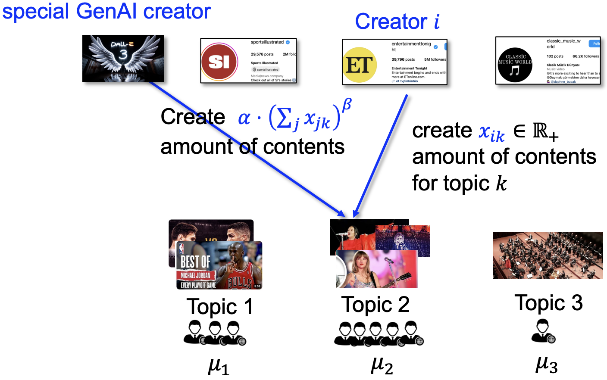
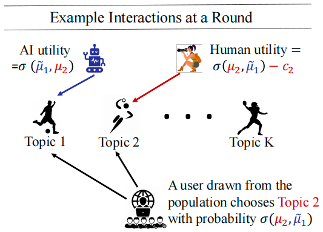

# 专题：人类创作与 AI 生成创作的经济学

## Human vs. Generative AI in Content Creation Competition: Symbiosis or Conflict?
Fan Yao, Chuanhao Li, Denis Nekipelov, Hongning Wang and Haifeng Xu **(ICML 2024)**

[论文链接](https://arxiv.org/pdf/2402.15467)

### 概括
当前 AI 生成的内容创作越来越流行，其相对于人类的创作而言创作成本很低，因此被广泛应用；当然 AI 创作需要基于优质的人类创作（目前看来 AI 自己合成的数据作为训练素材效果并不好），因此人类的智慧看起来也不可或缺。但一些现状（例如 TikTok 上大量的 AI 合成音乐）引发了一些焦虑：人类的创作是否会被 AI 创作彻底取代，即 AI 在内容创作方面会不会有一天占据几乎所有的市场？本文从博弈论的角度出发尝试回答这一问题，他们基于经典的 Tullock 竞争对这一问题进行了建模分析，并得出结论：在满足一定条件时，人类创作和 AI 的创作是可以共生的。

本文的讲解 PPT 也可以在芝加哥大学徐海峰老师的 slides 中找到：https://www.haifeng-xu.com/cmsc35401win24/slides/lec17-genAI.pdf，其中有一些生动的图示

### 预修知识
#### Tullock 竞争
Tullock 竞争是一种非常经典的竞争建模方式，他假定每个人的赢得某个奖励的概率是其投入的资源的函数，函数的形式是

$$p_i = \dfrac{r_i}{\sum\limits_{j=1}^n r_j}$$

其中 $r_i$ 是第 $i$ 个人投入的资源，$n$ 是参与竞争的人数。因此直观来看，每个人赢得奖励的概率就是他投入的资源占所有人投入资源的比例。事实上这能够很好的解释很多现实中的竞争现象，比如选举中越努力拉票越能获得胜利，一场比赛准备越充分越有可能获胜等等。

当然每个人投入一单位资源是有成本的，我们设为 $c_i$，并设奖励为 $R$，那么每个人的收益就是

$$\pi_i = p_i R - c_ir_i$$

当每个人投入单位资源的成本一致的时候，我们很容易算出一个对称均衡，即所有人投入一致的均衡；当每个人成本不一致时，计算就比较复杂了。

#### 纳什均衡的存在性
单调性与学习算法（待补充）

### 问题建模
**人类创作者**：假设有 $n$ 个内容创作者（用 $[n] = \{1,\cdots,n\}$ 表示）在 $K$ 个话题 $[K]$ 下竞争用户关注度。我们用 $x_{ik} \in [0,+\infty)$ 表示第 $i$ 个创作者在第 $k$ 个主题上的竞争力（竞争力由创作者创作的数量和质量综合决定），这也是每个人在博弈中需要决定的策略，对应于 Tullock 竞争中的资源投入，因此参与人 $i$ 的纯策略是 $\pmb{x_i} = (x_{ik})_{k=1}^K \in \mathbb{R}^k_{\geqslant 0}$，即参与人 $i$ 在全部 $K$ 个主题上的竞争力构成的向量。

还有一个重要的参数是参与人 $i$ 的成本，可以表达为 $c_i(\pmb{x_i})$，我们假设这是一个二阶可导的凸函数，事实上凸函数非常符合边际成本递增的直观。当然有一个进一步的假设之后可能会用到，就是成本函数是可分的：$c_i(\pmb{x_i}) = \sum\limits_{i=1}^K c_{ik}$，此时因为创作者的效用（之后会介绍）也可以写成在不同主题下的效用之和，因此此时我们可以单独研究各个主题下的策略选择，从而将博弈降维为 1-D competition。此时我们可以省略 $x_{ik}$ 的下标 $k$，用 $x_i$ 表达在 1-D competition 中参与人 $i$ 的竞争力，也就是他的策略。我们可以进一步假设成本函数的形式以便于讨论：$c_i(x_i) = c_i \cdot (x_i)^{\rho}$，其中 $c_i$ 是一个体现创作难易程度的系数，$\rho \geqslant 1$ 是体现难易程度的指数，$\geqslant 1$ 是为了符合凸函数的直观。

**AI 创作者**：AI 的创作成本相比于人类可以设为 0，并且 AI 的创作依赖于人类现有的全部创作。因此我们记 $s_k = \sum\limits_{i=1}^n x_{ik}$ 表示在主题 $k$ 上的全部人类创作，那么 AI 在主题 $k$ 上的创作为 $g_k(s_k) = \alpha_k \cdot (s_k)^{\tilde{\beta}_k}$，其中 $\alpha$ 表示 AI 学习人类创作数据的效率，$\tilde{\beta}_k \in [0,1]$ 则描述了 scailing law 的思想，即数据越多模型的表现会有一个次线性的提升。 

本文考虑了两种描述人类与 AI 创作的竞争模型，第一种描述了 AI 刚刚进入市场的状态，我们将 AI 描述为一个孤立的博弈参与人，因为现在还没有什么人会用 AI 创作，因此这种模型称为 Exclusive Competition；第二种描述了 AI 已经是人人都能掌握的创作技术的状态，此时人人皆可用 AI，因此 AI 已经内生于人类参与人中，这种模型我们称为 Inclusive Competition，接下来我们就来讨论两种模型的具体设定。

#### Exclusive Competition
根据前面的描述，这描述了 AI 刚刚进入市场，是一个比较独立的存在的情况，此时根据 Tullock 模型我们可以得到每个内容创作者 $i$ 在主题 $k$ 中的“市场占有率”：$\dfrac{x_{ik}}{\alpha_k(s_k)^{\tilde{\beta}_k}+s_k}$。如果我们假设每个主题的总市场，也就是用户的总关注度为 $\mu_k \cdot (s_k)^{\tilde{\gamma}_k}$，其中 $\mu_k$ 是一个流行程度的衡量，$\tilde{\gamma}_k \in [0,1]$ 是衡量总关注度随着这一主题内容总量增加而增加的速度的参数。在上述假定下，参与人 $i$ 在所有主题下的总效用为

$$\begin{align}
    u_i(\pmb{x_i},\pmb{x_{-i}}) &= \sum\limits_{k=1}^K \dfrac{x_{ik} \cdot \mu_k \cdot (s_k)^{\tilde{\gamma}_k}}{\alpha_k(s_k)^{\tilde{\beta}_k}+s_k} - c_i(\pmb{x_i}) \\
    &= \sum\limits_{k=1}^K \dfrac{x_{ik} \cdot \mu_k}{\alpha_k(s_k)^{\beta_k}+(s_k)^{\gamma_k}} - c_i(\pmb{x_i})
\end{align}$$

其中 $\beta_k = \tilde{\beta}_k - \tilde{\gamma}_k \in [-1,1]$，$\gamma_k = 1 - \tilde{\gamma}_k \in [0,1]$，在之后的分析中我们大都使用新的记号。以上的所有信息就可以完整描述 Exclusive Competition 了，之后的任务就是分析均衡。与传统的 Tullock 竞争模型相比，这里我们引入了一个特别的参与人 AI，因为 AI 事实上并不是智能的玩家，因为 AI 不会主动选择策略，AI 生成的内容量完全由人类生成的量以及前面介绍的公式确定，这种非智能性的、并且策略与其他玩家相关的情况是 Tullock 模型的一个新的变种，这也使得本文的研究具有一定的理论意义。

#### Inclusive Competition
此时我们假定每个参与人都可以使用 AI，因此每个参与人的策略集合变为 $\mathcal{Y} = \mathbb{R}_{\geqslant 0}^K \cup \{\perp\}$，其中 $\perp$ 表示选择 AI 生成内容而不是自己产生内容，这样我们就将 AI 内生于人类中。令 $\pmb{y_i} \in \mathcal{Y}$ 表示创作者 $i$ 的策略，则每个参与人的效用为

$$u_i(\pmb{y_i},\pmb{y_{-i}}) = \begin{cases}
    \sum\limits_{i=1}^K \dfrac{x_{ik} \cdot \mu_k}{n^{\perp} \cdot \alpha_k(s_k)^{\beta_k}+(s_k)^{\gamma_k}} - c_i(\pmb{x_i}) & \text{if } \pmb{y_i} = \pmb{x_i} \in \mathbb{R}_{\geqslant 0}^K \\
    \sum\limits_{i=1}^K \dfrac{\alpha_k(s_k)^{\beta_k} \cdot \mu_k}{n^{\perp} \cdot \alpha_k(s_k)^{\beta_k}+(s_k)^{\gamma_k}} & \text{if } \pmb{y_i} = \perp
\end{cases}$$

其中 $n^{\perp} = |\{i \mid \pmb{y_i} = \perp\}|$，$s_k$ 是人类创作的全部，注意我们假设 AI 创作与自己创作的量无关，这是因为目前 AI 合成的内容作为训练素材效果并不是很好。

无论是以上何种建模方式，本文的研究思路都是基本一致的：我们希望通过计算纯策略纳什均衡的存在唯一性来预测未来现实中可能出现的情况，通过分析均衡解的一些特点（例如解本身，或是效用、成本等）来分析人类创作和 AI 创作关系的可能性。

### 结论
#### Exclusive Competition

!!! 定理
    在 Exclusive Competition 的场景下，纯策略纳什均衡存在且唯一。

这是非常重要的结论，事实上来源于这一博弈的单调性，因此这一唯一的纯策略纳什均衡也是很容易通过学习算法得到的。那么接下来的核心问题就是要分析这唯一的均衡的一些特点，这些特点都基于 1-D competition 的假设：

1. 微观角度：均衡下每个人类的行为和效用如何依据参数的变化而改变
    - **人类的创作会随着创作成本的升高而降低**
    - 参与的人增多后，原先那部分的人的均衡创作数量会降低（因为会被卷到）

2. 宏观角度：均衡下整体创作数量如何根据用户关注度和人类创作效率的变化而改变

!!! 定理
    对任一足够大的 $n,\mu$（在现实中也是符合这一假定的），所有人类在均衡下的总创作竞争力之和 $s^* = \sum\limits_{i=1}^n x_i$ 满足：

    \begin{equation}
        \dfrac{C_\rho}{2\alpha + 2} < \dfrac{(s^*)^{\gamma+\rho-1}}{\mu \cdot ||\pmb{c^{-1}}||_{\frac{1}{\rho-1}}} < C_\rho \tag{1} \label{EX}
    \end{equation}

    其中 $\pmb{c^{-1}}$ 是 $\pmb{c}$ 的哈达马逆，即 $\pmb{c^{-1}} = (c_1^{-1},\cdots,c_n^{-1})$，$||\cdot||_{\frac{1}{\rho-1}}$ 是 $\frac{1}{\rho-1}$ 范数，$C_\rho$ 是一个取值依赖于 $\rho$ 但不依赖于 $\beta$ 的常数。

观察 $\eqref{EX}$ 式，我们可以发现，$\beta$ 并没有出现在式子中，只有 $\alpha$ 出现了，这表明**人类的创作此时受到 AI 创作的影响只是常数级别的，因此我们可以看到人类与 AI 共生的可能性**。更进一步地，我们假设所有人类的创作成本系数都在一个值 $c$ 附近，那么 $||\pmb{c^{-1}}||_{\frac{1}{\rho-1}}$ 约等于 $c^{-1}n^{\rho-1}$，$\eqref{EX}$ 式可以简化为 $s^* = O\left(\left(\dfrac{\mu}{cn^\gamma}\right)^\omega n\right)$，其中 $\omega = \dfrac{1}{\rho+\gamma-1}$。因此当用户关注度 $\mu$ 的增长比成本、人数的综合值 $cn^\gamma$ 的增长更快时，总创作会增多，因此**用户关注度的提高和成本的降低都是关键的提升总创作数量的方式**。

#### Inclusive Competition
很遗憾，尽管 Exclusive Competition 中纯策略纳什均衡存在且唯一，但 Inclusive Competition 的场景下纯策略纳什均衡可能不存在。我们需要将条件放宽到成本函数可分，即我们研究 1-D 竞争，此时在一定条件下纯策略纳什均衡是存在（但不一定唯一）：

!!! 定理
    在 Inclusive Competition 的场景下，假定参与人 $1,\cdots,n$ 按照成本系数 $c_1 \leqslant \cdots \leqslant c_n$ 的顺序排列。如果 $\tilde{\beta}+\tilde{\gamma} \geqslant 1$，纯策略纳什均衡存在（不一定唯一），具有形式 $\pmb{y^*} = (x_1,\cdots,x_{n-m},\perp,\cdots,\perp)$，即创作成本最高的 $m$ 个人类创作者会选择使用 AI 生成创作。

    除此之外，对于足够大的 $n,\mu$（在现实中也是符合这一假定的），均衡下使用 AI 生成创作的创作者比例具有如下渐进下界：

    \begin{equation}
        \dfrac{m}{n} > 1 - C \cdot \dfrac{\mu^{\frac{\gamma-\beta}{\gamma+\rho-1}}}{\alpha n^{1-\frac{(\gamma-\beta)(\rho-1)}{\gamma+\rho-1}}} \tag{2} \label{IN}
    \end{equation}

    其中 $C$ 是一个取值依赖于 $(\beta,\gamma,\rho,c_1)$ 的常数。

关于这一定理的讨论如下：

- 事实上，我们无法从理论角度保证均衡唯一性，并且很难从理论上研究所有均衡的性质，但文章的实验表明，多个均衡的情况下，不同的均衡也具有类似的性质；
- 这一定理的结论直接表明了如下事实：**创作成本高的人类创作者更有可能转向使用 AI 创作**
- 对 $\eqref{IN}$ 式进行参数分析，会发现等号右侧关于 $\alpha,\beta,n$ 是递增的，因此当 GenAI 的能力很强，或者创作人数增多时，AI 创作占比会更高；此外，如果 $n \to \infty$ 或 $n^{1-\frac{(\gamma-\beta)(\rho-1)}{\gamma+\rho-1}}$ 的增长 dominates 了 $\mu^{\frac{\gamma-\beta}{\gamma+\rho-1}}$ 的增长，那么 AI 创作占比会趋向于 1，这表明，**如果用户关注度的增长赶不上内容创作者的增长，使用 AI 将会成为更流行的选择，只有最会创作的人才会继续坚持自己创作**（很直观，因为卷的时候用成本低的方式更容易卷出头，或许也是一种囚徒困境）。

### 模型可改进的方向与未来展望
#### 可改进的方向
个人认为，这篇文章考虑的问题是很有价值的，也有一定的理论贡献，当然文章的模型设计可能还有一些问题可以改进：

- 首先用户对主题 $k$ 的关注度 $\mu_k \cdot (s_k)^{\tilde{\gamma}_k}$ 为什么只取决于人类创作 $s_k$，而忽略了 AI 创作的部分，这一点可能值得质疑，当然实际上可能近似的处理并不影响最终的结果
- 是否存在一个人可以选择自己使用 AI 以及个人智慧创作的混合策略，这一点也值得考虑
- 1-D competition 的假设可能很强，因为不同主题之间的竞争可能是相关的（例如一个人在某个主题上有很高的流量，那么其他方面的创作关注度也不会低），并且在 $k$ 个主题之间应该也存在总的一个人创作瓶颈、创作时间的约束

#### 未来展望（from 徐海峰老师的 slides）
- Copyright issue
- **What if GenAI platforms have to pay creators for acquiring their authentic data for training GenAIs, and how to acquire such data?（如何为人类创作定价？）**
- What if GenAI platforms charge creators for generating contents?（人类使用 AI 平台创作也需要收费）
- **Authentic contents can now profit from serving Internet users AND serving GenAI platforms – how would this change the competition?**
- What about the “search engine + conversational engine” competition?

因此关键的问题在于：**人类创作作为一种特别的数据，应当如何定价？为人类创作定价之后，将会如何影响人类与 AI 创作的共生？**

## How to Strategize Human Content Creation in the Era of GenAI?
Seyed A. Esmaeili, Kshipra Bhawalkar, Zhe Feng, Di Wang, Haifeng Xu

[论文链接](https://arxiv.org/pdf/2406.05187)

### 概括
本文的背景与上一篇类似，也是考虑人类创作与 AI 创作之间的关系。但本文相对而言视角更加宏观：本文利用多臂老虎机模型研究了人类创作和 AI 创作之间关系的的演化过程，这是大部分工作所没有涉及的。这篇文章将创作主题分为两类：一类是 time-sensitive 的，即随着时间的推移，内容会折旧的主题，例如新闻、流行音乐等；另一类是 time-insensitive 的，即内容不会随着时间的推移而折旧的主题，例如历史、知识等。在 time-sensitive 的主题下，不存在多项式时间算法最大化人类的效用（除非随机指数时间假设成立），因此作者提出了一种 2-近似的算法；在 time-insensitive 的主题下，存在多项式时间的精确算法，但分析结果表明人类会逐步退出内容创作这一市场。

这篇文章的相关工作部分给出了最近很多的有关于人类创作者之间竞争的研究文献，可以选择感兴趣的进行阅读。

### 问题建模
#### 基本设置
假定有 $k$ 个不同的主题 $[k]$，每个主题我们都可以视为多臂老虎机的一个 arm，人类还有一个退出、效用为 0 的 arm。在这一模型中我们将人类全体和 AI 全体视为两个整体研究（因此只有两个玩家，这样虽然忽略了内部竞争，但可以有效研究两者之间的关系），AI 的 cost 仍然归一化为 0，因此人类的 cost 定义为相对值 $c_i \in [0,1]$，表达人类创作出主题 $i$ 的内容需要的成本；人类创作的主题 $i$ 带给用户的效用为 $\mu_i$。

#### AI 能力的建模
我们考虑 $T$ 轮的创作竞争，用 $b_t \in [k]$ 表达人类在第 $t$ 轮的创作选择，用 $a_t \in [k]$ 表达 AI 在第 $t$ 轮的创作选择。根据前面的介绍，人类选择 $b_t$ 给用户带来的效用为 $\mu_{b_t}$，AI 选择 $a_t$ 带来的效用 $\tilde{\mu}_{a_t}$ 则需要精心的设计，因为 AI 的创作是基于人类已有创作的。设 $\gamma_i$ 为第 $i$ 个主题的折旧率，这与主题相关，$0 \leqslant \gamma_i < 1$ 的对应于 time-sensitive 的主题，$\gamma_i = 1$ 的对应于 time-insensitive 的主题。因此截止到第 $t$ 轮时，人类创作主题 $i$ 的总次数的贴现为

$$N_i(t) = \sum\limits_{s=1}^t (\gamma_i)^{t+1-s} \times \mathbb{I}(b_s = i)$$

从而我们可以假定 AI 创作的主题 $i$ 带给用户的效用为 $\tilde{\mu}_i(t) = \mu_i - g_i(N_i(t-1))$，其中 $g_i(\cdot)$ 衡量了 AI 创作与人类创作之间的 gap，并且 $g_i(\cdot)$ 是一个单调递减的函数，因为人类的创作越多，AI 能学习的越多，与人类之间的 gap 也会越小。

#### 竞争建模
建模方式非常简单，每一轮 $t$ 人类和 AI 创作者选择自己要创作的主题，然后会有相应的用户效用 $\mu_t$ 和 $\tilde{\mu}_t$，用户根据如下偏好函数 $\sigma$ 选择看哪个创作：

$$P(i \succ j) = \sigma(\mu_i,\mu_j) \in [0,1]$$

上式的含义为：用户选择 $i$（认为 $i$ 比 $j$ 好）的概率由函数 $\sigma$ 决定。因此 $T$ 轮之后人类和 AI 的总效用分别为

\begin{gather}
    u_T(\pmb{b};\pmb{a}) = \sum\limits_{t=1}^T [\sigma(\mu_{b_t},\tilde{\mu}_{a_t}(t)) - c_{b_t}] \\
    u_T^{\text{AI}}(\pmb{a};\pmb{b}) = \sum\limits_{t=1}^T [\sigma(\tilde{\mu}_{a_t}(t),\mu_{b_t})]
\end{gather}

人类的目标是确定自己的策略最大化自身效用。

### 展望

因为本人目前也不是很懂多臂老虎机相关的工作（看 pub list 本文的第一作者对这些方面非常熟悉），因此也不好有什么评价，但总而言之是一种可以用于动态表达人类与 AI 之间竞争的模型（但本人总觉得多臂老虎机像一个通用模型，因此缺乏一些自然的美感）。从模型本身来说，可以进一步考虑人类和 AI 内部的竞争，也可以像上一篇文章一样考虑人类使用 AI 的情况。除此之外，本文暗含人类和 AI 创作速度相同的假定（每来一个用户都同时提供创作），因此之后也可以考虑 AI 创作速度高于人类的更贴近现实的情况，并且 AI 在不同主题下的创作能力也不一定是独立了，这些都是可以扩展的。

还有一个很关键的问题是，因为本文的结论是人类会逐渐退出创作，这样的结果与社会福利最大化之间是否存在矛盾？应该如何设计机制解决这一矛盾？也许补偿机制就是一个解法，因此又可以回到我们要研究的问题上，因此我们工作的一个可能的 motivation 就是尝试建立一个 AI 与人类的平衡，最大化社会福利。